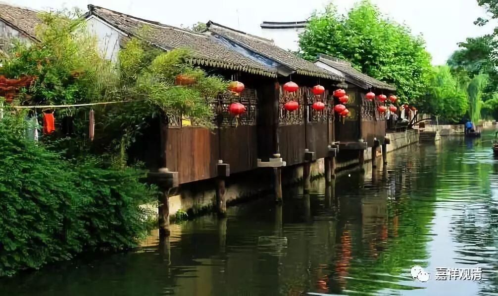

##  《菩提速道》讲记091(上) 

我们通常讲 “知法犯法，罪加一等”，就是这个意思，拥有圆满戒律时候 ，行善的善业积累很快。若以戒律 之身为恶， 所作的罪 也会放 大。 

**“对于以上所说生起深刻的信心，于十善等，哪怕极微细的善业也努力去作，”**

关于这点，我们的刘备同志就说得很好，是吧？ “勿以恶小而为之，勿以善小而不为。” 佛教里诸佛通用的戒律也说： “诸恶莫作，众善奉行！” 好事都要去做。坏事别去沾 ……

**“即使十不善中极微细的恶业也努力防护不令三门沾染，精勤地弃恶修善。惟愿上师天加持令我能如是而行！”**

最小的恶业也不做，些微的善业都要积累，自己努力去实践，自己做不到、做不好的时候，请师长、三宝加持我能这样做到 ……

说是这么说了，但是真正做的时候，你如果不知道什么是善、什么是恶的话， 上面 这些话都是空洞没有意义的。你必须明白哪些是善的、哪些是恶的，那么你至少要去大量阅读佛所制的戒律或者 师长 相应的开示。 

**“这样祈祷以后，观想顶上上师天身分中降下五彩光明甘露，注入自他一切有情身心之中，自他一切有情无始以来所集的一切罪障皆得以净除，尤其净化了如是如是的障碍，……，自他一切有情心中生起了如是如是的殊胜证悟。”**

和前面一样的观想消除障碍， 积累资粮，但内容是这里的业果安立。 

这个也是从十善业来谈的。刚刚已经讲过十善业了，但是大家也知道，有些 戒律方面的 内容不见得包括在 十恶业、 十善业当中的，比如说喝酒、抽烟、吸毒等等， 这些 也都是不应该做的。 十善十恶是一个大的原则。 

