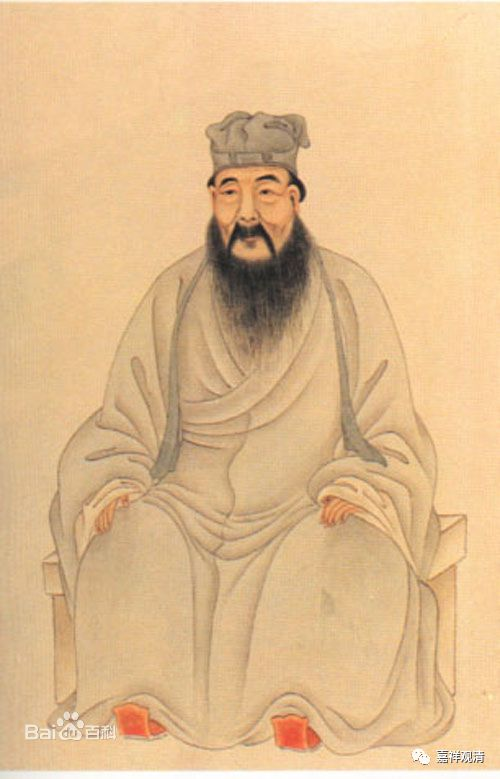
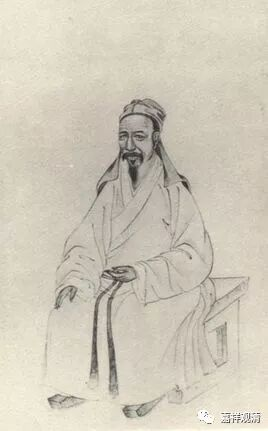

##  《菩提速道》092（四） 

**“有诸先哲善知识说：‘攀缘外境的心是最粗硬的呀！’”**

《西游记》每一回的回目，大家有空可以看看玩玩，这里面很有意思的，有点像指导你修行的意思哦。就像我们今天的文章都要取个好的题目来耸动人心 ， 是吧？这里面确实有很多的文字 都 像修行的话哦。孙悟空叫 “ 心猿 ” ， 白龙 马叫 “ 意马 ”，猪八戒叫“木母”， 是吧？ 

**“因此较之先前未作闻思修，心变油滑过失更大。”**

所以 ， 有时候 对那些已经了解了很多 佛教内容的人，你再教他学佛，反而很难。当然这要看对佛教了解很多是什么样的了解 ， 这是个问题 。 但是如果他之前已经被前面提到过的那几 位水平很差的法师 教育过了，你再来教的话，基本上是改不过来了，太难了。 （这个我深有体会，但凡外面认为学得好的，在我们这里 基本就 就没戏了，学不下去了 ……他永远是那一套思路，拧不过来的。所以佛教的启蒙老师很重要。） 

**“因此，宗喀巴大师在道次第中说：‘于闻解后，尚须修习，随自力能，修所闻法，是为至要。’”**

就是听闻了 之 后要去实践。这句话不就是 “ 学而 时 习之 ” 吗？学习了以后是要去实践的。 清代儒学里有个颜李学派，就是发挥这一句话 “ 学而时习之 ”，把“习”解释为实践——学了并付诸实践！（我们小时候学的标准答案，说“习”是复习——那应该是误读啦。） 

##  （颜习斋） 

##  （李恕谷） 

**“所以，我们应经常地发誓修习正法，不再迷恋外在虚妄的亲友、自己的这副臭皮囊以及虚幻的资财受用等尘缘。**

亲友们 “为了你好”的名头下，留你在轮回受各种苦；为了自己的这副臭皮囊和虚幻的数字，我们也是恶行累累……该看破放下啦！你看不破，终归有人教你 看破的！ 

**（宗喀巴大师）又说：**

**‘以是此心，纵觉难生，然是道基，故应励力。’”**

这个心要生起来， 的确 是很难的 ，但再难也要生起来，他是 修行的基础 。 

**“修习了这些下士道的教法，如果现在心中仍未能生起，我们应当强烈地祈求上师三宝加持令得生起。还要努力积资净障，对所缘行相应比以前更加勤奋地修习，并发愿在未来的生世中能够生起。”**

修不起来怎么办？自利未逮时， 别忘了求加持！ 

