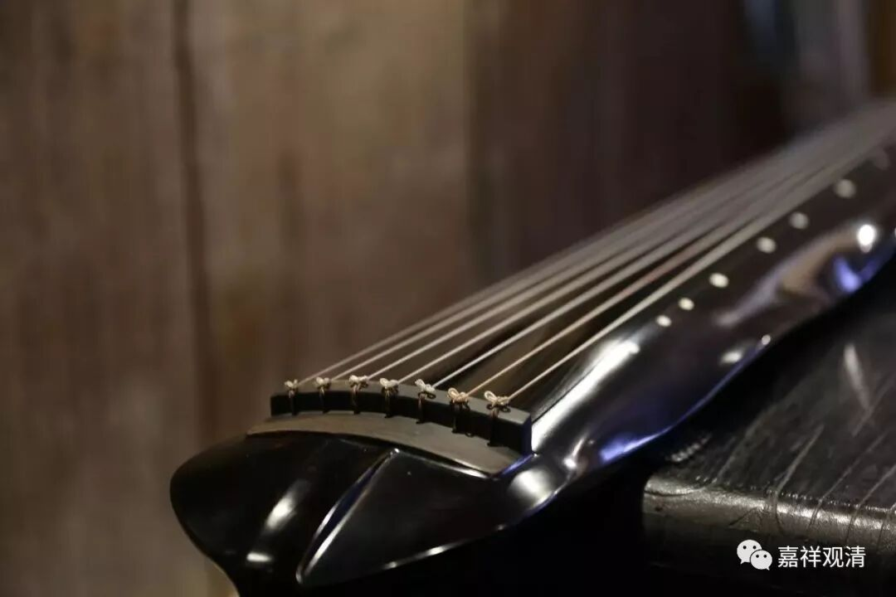
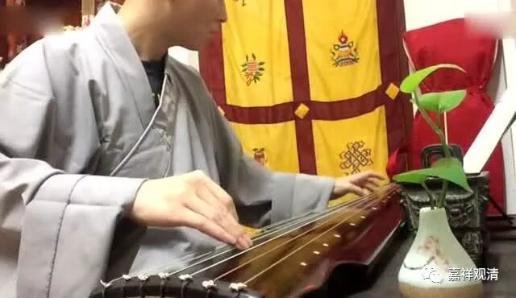
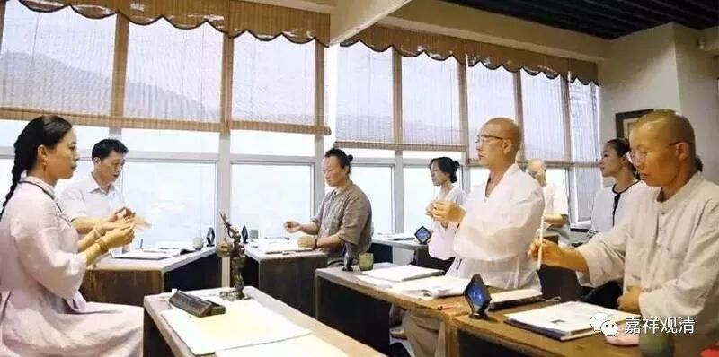

##  《菩提速道》讲记093（上） 

修习了这些教法 ， 都是应该在心中生起的。我们修行人聚在一起 ， 应该相互比比蒲团被磨破了几个 ， 或者家里的地板因为嗑头而被磨出 多少 槽印 。 这 才 是修行 人 应该互相攀比的 ， 是吧？ 可是现在呢， “修行人” 都在比的是 ： “ 我已经能谈三 支 曲子了 。 ” 或者说 ： “ 哎呀 ， 我今天买了二两沉香 。 ” “ 我这儿有几饼好的普洱茶 ” 唉 ……比的东西都不对 。 

我们真正应当祈求的是在心中生起这些教法，还要自己去做，如果做不到呢，就请上师三宝加持，希望自己能够早早地生起。否则的话， 若 没有下士道、中士道的这些 扎实的 基础，纵然把自己说得很高 —— “一切 都是为利众生 ” ，自以为发起了菩提心，实际上却是像能海法师说的那样，叫 “鸡毛菩萨” ，都是嘴上的功夫！ 

甚至有些法师已经自己给自己授记了： “我将在XXX世界XXX地方成佛，这个佛的名字叫XXX。”还跟大家约好了：“老和尚我就要死了，我的净土在XXX地方，我们净土见吧。”这些都是空话。这种人就叫“鸡毛菩萨”，什么意思呢？风一吹，“呼”地就上去了，飘得很高。风一停，就落下来了，因为没基础的。 （这还是往好了说，往 糟了讲，难免大妄语啊！） 

元代 曾经有一位 禅师 ， 愚庵智及禅师， 学问也不错， 在南京 一直和一些名流士大夫们在一起诗赋往还、流连游戏。 结果他的师兄找到他，给他说了一句话，他就去闭关了。他的师兄说： “当 记 取黄叶飘飘。 ” 你想想看，秋天的那个叶子，也是风一刮就飘得很高，实际上自己是没有根基的，还会落下来。他也算听懂了，就立即去闭关了。后来水平怎么样不知道，反正是闭关了三五年才出来 ，最后是明初的十大德之一 。 

**“如宗喀巴大师说：**

**‘彼所开示教授中，暇满义大及难得，**

**速坏复受恶趣苦，救此皈依业果等，**

**善思而获坚固解，是为已摄正道本。 ’”**

这些 “暇满义大 难得 ” “恶趣苦”“皈依”“业果” 等等， 在这上面生起定解、生起相应的觉受， 才是 佛法修学之 根本。 

