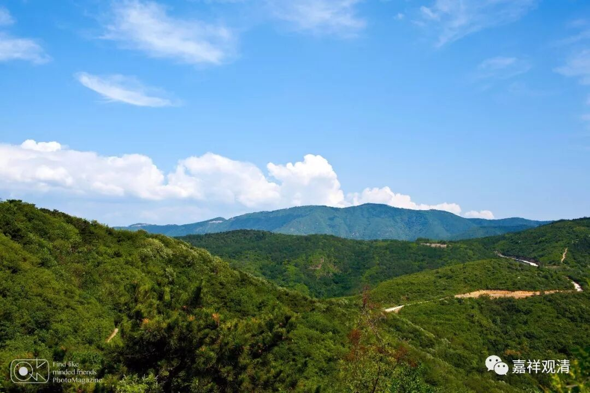

##  《菩提速道》094（下） 

**“庚二、正行分二：**

**辛一、思惟轮回总苦。**

**辛二、思惟轮回别苦。**

**初者，在顶上修习上师天的状态中，如是思惟：**

**我如理地学戒持戒，断除十种不善，由此虽可超脱恶趣的痛苦而获善趣之果，然而还没有得到断除苦根的解脱，实在也无丝毫的快乐时光可言。 ”**

持戒能保证不堕落，但一般而言，并不直接保证解脱。同时，下一世 情况 虽在善趣，但是不是还继续修行却 是不知道的。 善趣虽然有快乐，但仍然在轮回里。 

**“譬如一个囚犯一个月后定将被处死，其间每天还受着火漆滴身、棍棒加身等的酷刑楚毒。”**

这个 “火漆滴身”应该是 以前 藏 地 的刑罚，可见这些刑罚挺 恐怖 的呀。 

**“这时虽由某人的情面等免除了严刑拷打，然而即将被杀的痛苦却每天迫近，也只有那么一点短暂的快乐时光。同样，因为没有获得从根本上断除轮回的解脱，任由获得如何的善趣身，一旦往昔的善业牵引力尽，又会堕入恶趣，无奈饱受无量的痛苦。”**

就是这个 在善趣的时间 过去了之后，我们的根本烦恼还没有断除，不知道哪天又会堕下去了。 

**“（一）无定过患：**

**另外，在这个轮回之中，只要是由惑业所受生， ”**

因为烦恼和业才受生的嘛。 “惑”，就是烦恼。 

**“从此之后，就摆脱不了痛苦的自性，亲变为仇，仇复为亲，相益相害不可保信。”**

对你到底是有用的还是有害的，你是不知道的。我不知道你们大家现在觉得自己怎么样，可能都觉得自己挺顺的。但是，你其实可以这么想： “顺”这个事情是短暂的，或者说是不靠谱的。你想想你自己以前造作的善恶业，你就知道后面一定有受灾等着你，肯定会有的。 

比如说最近吧，我们庙里都还挺好，但是我还是有点慌的。因为我是真的这么想的：我上辈子并没有做到完美的好事，这辈子绝不会这么平平淡淡地过去，不可能的！不会这样平平淡淡的，一定会有其他的事情在后面。 

对你们来说也是一样的，到目前为止很有可能还都是一帆风顺的，但是， “在海上久了，一定会碰上台风”。大家赶快准备好吧，或者早点忏悔，把自己的罪业忏悔干净。 

在声闻乘当中，基本上没有这种很强烈的忏悔方法，但是菩萨乘和密乘当中都有相应的强烈的忏悔方法。在这些罪业还没有成熟之前，我们用一些方便法让这些罪障晚一点出现，然后在这些推延的时间当中，尽快地把这些罪障忏悔干净。 

我们自己稍微想想就知道了，以我们今天所做的这些善恶夹杂的事情，绝不可能我的上辈子做得比现在好到什么程度去。那么，今天在我们面前所出现的这些安乐 ——假如可以说是安乐的话，那都真的是很短暂的，不可保信的。而你的恩人和仇人也是一样，都是不可保信的。 

**“如龙树菩萨说：**

**‘母或改为妇，父乃转成儿，怨家翻作友，迁流无定规。’**

**‘笞母食父肉，恶敌拥怀中，妻啃夫之骨，轮回殊可笑！’”**

舍利弗说在他修行以后只笑过两次，其中一次就是看到龙树菩萨 在 这段话 里提到的的这个事件 。还有一次呢，是看到一个人在锯树，树神还没有跑掉，这个人就已经在锯了。树神可能衣服还没有来得及脱呢，就被那个人锯到腿了，树神就叫起来： “哎呦！哎呦！哎呦！”舍利弗当时看到了，就笑了一下。 其他的时间呢， 舍利弗没有过笑脸 ——好严肃啊！ 

