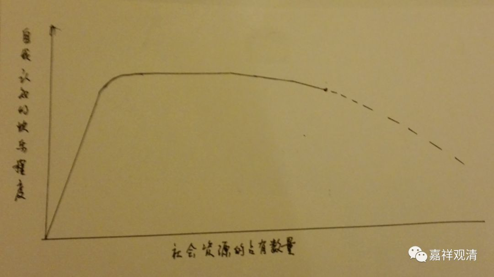

##  《菩提速道》095（二） 

**“（二）无饱足过患：**

**任如何受用轮回的安乐，都没有满足的时候。”**

轮回的安乐永远没有满足的时候，我们总是不断不断地去想， 不断不断地想要 往上。到底应该说这是社会进步的因呢 ， 还是应该说社会的进步是建立在我们的贪念之上 的呢 ？好像真的有可能是后者哦。 

我们就是在不断不断地往上追求 —— 所谓的进步 、 “ 自我实现 ” ， 是吧？ 我们希望明天比现在更好，但我们不知道什么叫 “更好”——更方便？更舒适？更自由？更安逸？我们要求更安逸， 肯定是 我们对未来的追求 的 其中的 一个 动力 。 我还记得小时候学发明的时候，老师 就 说： “科技的进步，懒是一个动力。” （ 所以很多科学家都是男的 ， 是吧？因为懒。 ） 有些内容 就 不多说了，不断不断地追求，到最后一下子就崩盘了。 因为预设的前提是错的，总会出现机构性的崩盘！ 

**“如《广大游戏经》中说：**

**‘大王即令天之乐，及与人中妙乐欲，**

**诸乐令此一人得，彼亦无足仍求觅。’”**

你 把再多 的东西给他，他还是贪心很重 —— 大部分人都是这样哦 。 这背后有其心理原因 ——世间人的快乐，人们对快乐的自我感知度，和占有资源的数量积累，是线性分布的吗？我觉得假如做一个统计的话，最初会是一个快速上升曲线，以后是有一段略微平缓的曲线。大概在一个极端之后 还会下降如下图，因为当物质占有到一定程度，没有其他人可以做对比，那种因对比而来的幸福感绝对会降低。不是有一句话吗 ——幸福感来源于对比。（有机会的话我们可以编一个心理测验。） 

（图示1.0版，2.0版稍后推出   ） 

那么，他们无饱足地求觅，是求的外在的物质吗？我觉得不是，其实人们求的是幸福、快乐，只是，大家都不真正知道什么是幸福、快乐，一直误以为（被社会催眠为）占有是幸福的必要条件。所以佛陀说：你们走错路了！那些都是苦！ 

那么 ， 少部分的人呢， 看起来贪心不那么重的呢？可能 需要帮他去做一个甲状腺的测试 （ 甲减的症状是对什么都觉得无趣，和甲亢的兴奋相反 ——开个玩笑 ） 。 

