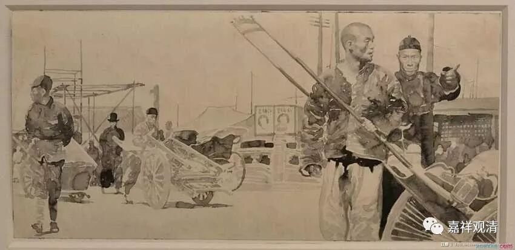
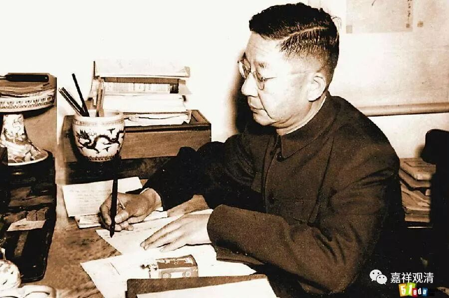
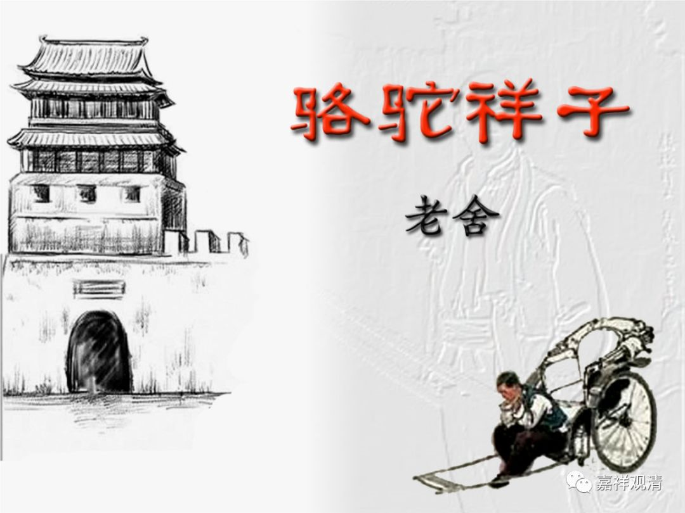

##  《菩提速道》096（中） 

**“（六）无伴过患： ”**

你还要准备在自己走的时候有个伴吗？ 当然历史上各个民族都出现过 ——殉葬，殉人或者殉马等等。 

**“自己终须独赴他世，友伴也不可凭赖。”**

他们根本不会跟你一起去的，你就别想了。 最多你幽默地道个别： “兄弟我先走一步！……”

**“如《入行论》中说：**

**‘独生此一身，俱生诸骨肉。**

**坏时尚各散，何况余亲友？**

**生时独自生，死时还独死，**

**他不取苦份，何需作障亲！’”**

你的这一生，就是一直和你在一起的这个身体骨肉，在你死的时候，还是你归你走， 它 归 它 走 ， 对吧？**“何况余亲友”**， 更何况其他人呢？**“生时独自生”**，生的时候 都是 各自生的 。**“死时还独死”**，死的时候还是你一个人走 。**“他不取苦份”**，他人没有办法取你的苦的一份 。**“何需作障亲 ”**。 

我们现在微信上、微博上每过几天就可以看到 一些 感情的宣泄 ： “ 唉， 又不相信爱情了 。 连安吉丽娜 · 朱莉和布拉德 · 皮特也离婚了，又不相信爱情了 。 ” 过几天， 谁谁谁又结婚了 ： “我又相信爱情了 ！ ”然后再过几天又可以看到谁谁谁离婚了 ： “又不相信爱情了 。 ”

这 些 都是悲剧。你看我们 大家 是多么脆弱啊，只要有一个观点不一致 —— 比如说对孩子的教育意见不合，就可以使婚姻关系瓦解 ，实在是 太脆弱了 。现在的 婚姻关系太脆弱了， 真的 是需要努力才可以维护下去。而以前之所以不怎么努力也 可以 维护，是因为大家那时候的生活都太苦了，根本离不开对方。我真的 是 这样认为的哦。 

##  （老舍先生） 

我以前很喜欢老舍，你看老舍写的那些关于老北京的作品里面，都是 “ 相依为命 ” 的。以前的那些家庭，是社会的最小单位 。 这个最小单位需要家庭中的这 两 个人或者三个人、四个人相依为命，少了其中的任何一个人，这个 最小单位 就很难再维持下去，真是很苦的。老舍的很多作品都是描写北京平民的生活，就是这样平平淡淡的相依为命的情况 ， 所以家庭反而很稳固。今天呢，不需要互相依靠了，每个人都可以自己独立生活 ，所以家庭很不稳固。 

同样的，寺院也是一样情况。以前你离开了寺院，作为一个出家人基本上很难在世间上独立生活。但今天这个寺院的模式肯定要被打破了，因为大家不需要在这样大型的寺院当中也能够自己活下去。经济状况已经发生了很大的变化，其他的情况一定会跟随产生相应的变化。所以将来这个寺院的模式可能会被大量的精舍所替代。  

