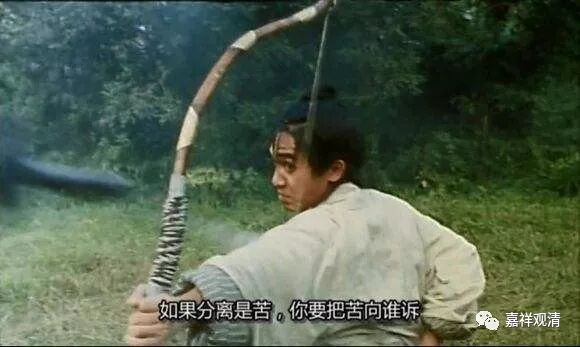

##  《菩提速道》097（中） 

**“壬二、思善趣苦，分三：**

**癸一、思惟人苦。**

**癸二、思惟非人苦。**

**癸三、思惟天苦。**

**初者，有了人的五取蕴，就有了饥渴和追求的痛苦，毫不顾忌任何的罪恶痛苦、恶言毒语，用种种手段来谋取受用财物。自己稍有了财物，就有各方面的人施以苛捐杂税压榨剥削，或者借贷、偷盗、巧取豪夺，用种种手段令自己不得不忍痛割爱地拿出来 ……承受着这样的痛苦。”**

我自己就碰到过，有些情况就是这样的。你有了钱以后，你就有一些什么样的痛苦呢？就是各种各样的人，甚至是亲朋好友，都要想办法从你这里挖一些出去。或者是从你这里借钱，你又纠结借给他之后会不会不还，也是承受着各种各样的痛苦。 

村里面的老居士们叫我 “唐僧”，我说：嗯，对的，我就是唐僧，为什么呢，取经路上那些个妖怪都觉得你的肉“好又多”，是个过路的地方就有妖怪想要咬你一口……

我有个兄弟，去和别人打高尔夫球，结果就借给人家几千万，最后收不回来了。 我想呢， 哎呀，你要是捐给我多好啊，是吧？还会有功德呢！以后是不是应该请我打球啊？然后我就可以很轻易地输给他，再让他借钱给我就行了。 

佛教说，财产 是四家共的 ——王、贼、水、火。 

**“为了守护财物，又要求告长官、直言犯谏、相诤相斗、巡查守卫等，乃至于废寝忘食等的痛苦。”**

这个苦啊，苦啊。 由贪引生诸多苦 ……

不过，我们往往还是会像歌里唱的那样： “ 好多事情当时一点也不觉得苦， 就算是苦，我想我也不会在乎 …… ”这就是我们这种人。也许以后这种苦我们会在乎的，但是当时就是看不清楚， “ 好多事情都是后来才看清楚 ，然而我已经找不到来时的路 ……” 。 

