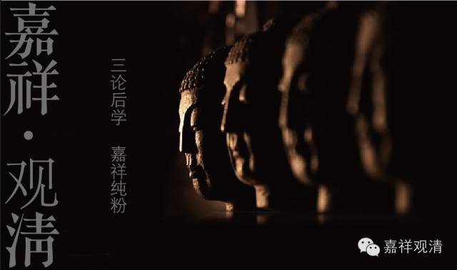
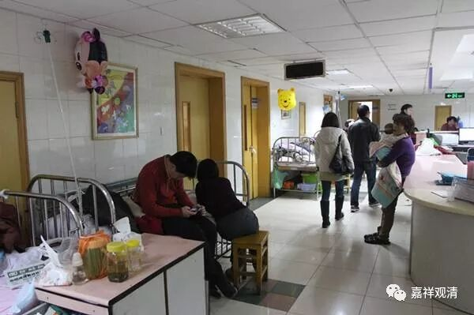
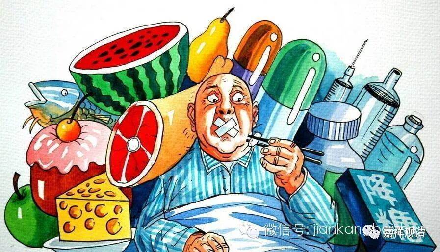
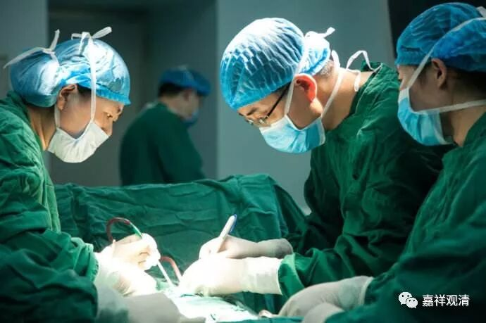
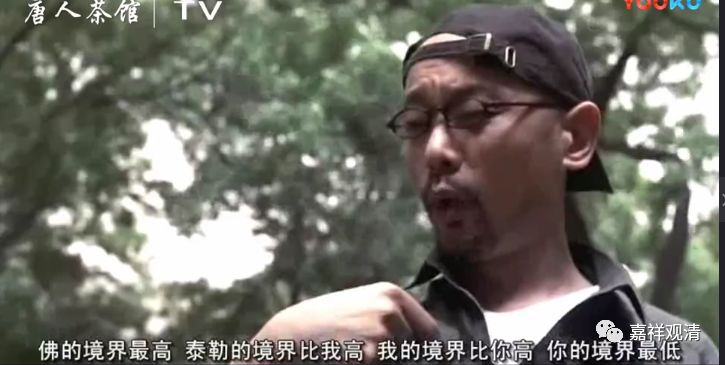
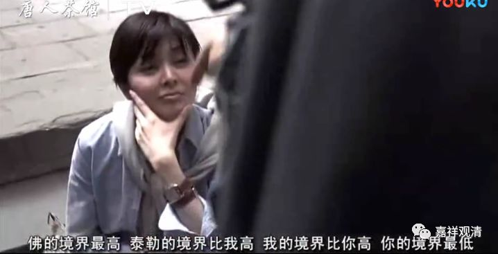

##  《菩提速道》098（三） 

**“（六）病苦：身体皮肉干枯，”**

病苦， 这 我们 在医院里 可以 看到很多啊 。 “皮肉干枯”，皮肤都皱巴巴的 。 特别是重病之后、大手术以后，或者老年人， 有些口干，只能用棉签蘸水抹抹嘴唇 ……

**“肤色暗淡，心中烦躁不安；”**

皮肤没光泽了。中医说不管脸上青黄赤白，只要有光，就是阳气还在，病容易治；看到不管什么脸色， 没光了，枯蒿暗淡，则属阴，病就难治了，病程也会长。 

心中烦躁不安：生点大病被限制活动、限制饮食等等，呆在病房里等待检查报告、等待手术、等切片报告 ……心情也不愉快。 

**“平时喜爱的食物等却不能自在享用； ”**

想吃 点 什么 好 东西，医生却和你说 “你有两个东西不能吃， 这个 也 不能吃，那个 也 不能吃， ” 想吃的统统都不能吃。不想吃的东西呢，这个 苦的药 要吃，那个 催吐的药 也要吃。 糖尿病人柜子里藏的零食，还要被医生护士没收 ……不能自在享用。 

**“还要依靠猛厉的治疗法；”**

然后我们还看到各种猛厉的治疗法 ——这个要切掉，那个也要割掉。你想要得到很温柔的治疗法，不给！ 在这里烫一块疤，又在那里扎上一排针，跟插秧似的 ……

中医里面现在很少用疤痕灸，特别是脸上 基本上不用了，但藏医还很喜欢用，上次罗州大师要在我脸上烫疤，被我 “喝”止了。（不过疤痕灸效果真是不错的，对有些病有特效，比如……好吧，其实我都忘了。） 

**“提心吊胆地怀着死亡的恐惧之苦。”**

你躺在病床上，看着边上的人： “哦哟，2床 推出去了 。啊？！ 5床也 在抢救了 。怎么我这个病房 两天 已经 走 了四个人了？那下一个会不会是我啊？传说我这张床上刚死过一个人，看样子我也逃不了了 …… 哎呦，医生跟我儿子在走廊里说话呢 …… ”总之，就是“提心吊胆地怀着死亡的恐惧之苦”。 

不知道你们怎么样，我每次生点稍微大点的病会生起 “ 苦啊，接下来 要好好修行 ”的心，不过，好了伤疤忘了疼。 

我有个师父说：生点慢性病挺好，一下子死不了，还可以借这个机会老是想着众生。这都是境界啊！ 

师父的境界比我高，我的境界比较低 ……

