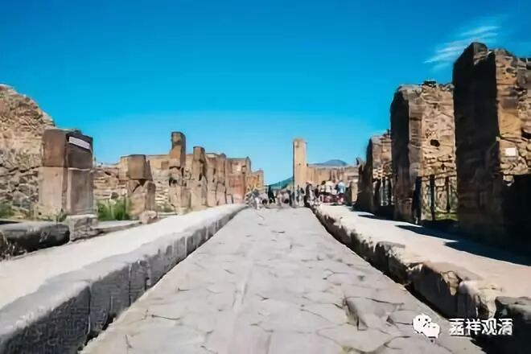

##  （庞贝城一夜之间变成废墟，一个城市的生命瞬间被凝固于历史。） 

##  《菩提速道》098（四） 

**“（七）死苦：有不得不舍离亲人、身体、家财、朋友等的痛苦。”**

死的本身并不是苦，这里的死苦是指死亡的过程。通常我们会说 “一了百了”，真的到最后“一了百了”的时候，倒是轻松的。就是在这个死亡的过程当中，是很苦的，因为舍不得，根本舍不得离不开嘛。 

**“如《广大游戏经》中说：**

**‘若死若殁死殁时，永离挚爱诸人众，**

**无可回还重相遇，犹树落叶同逝水。 ’”**

“ 落花流水春去也 ” ，我们也 “ 去也 ” 。我们修行的话，至少将来要死得漂亮一点，死得潇洒一点吧。可以对着你爸爸说： “明天我就不来了啊。”走了，而且走得很有腔调的。 

最作孽的就是收了不好的徒弟，你临死前连饭都吃不到，徒弟就把 犄角旮旯找来的 蔬菜榨成汁，给你喂下去。碰到这种徒弟真是倒霉啊！你想吃什么都吃不到，他还告诉你： “这是为了你好 ！ ”给你搞出各种名门秘方，你也拿他没办法啊。你自已经没有自主能力了，到时候就是徒弟说了算，他要给你打什么针，就给你打什么针。 

问题在于，这个徒弟不是医生，他不是医生啊。比如我们都在吃石榴的籽，他却把石榴的皮榨汁给你喝，涩得要命。他还振振有词地说： “这个是为你好，这个皮能够调整血液的PH值。你的血液变成碱性的话，对于癌症的治疗会有帮助。”唉，收到这种徒弟，你可真是苦死了。 

所以一定要谨慎收徒。这种徒弟也教不好的，他从来不认真学习的。可是一到师父病重的时候，这种徒弟就意气风发地冲到你房间里来了，要给你治病，要开始表现。他还会把其他人全部赶走，把医生也全部赶走，最后还说： “你看看你们，最后只有我在师父身边。”哎呀，要请佛菩萨降甘露啊，让我不要遇到收了这种徒弟的障碍，帮我消除 这类障碍 吧。 

这里面就讲了七苦，还有一个 “五蕴炽盛苦”没讲。最后这个“五蕴织盛苦”是最强烈、最真实的啊。 

在《阿含经》当中，对于前面的 爱别离苦、怨憎会苦 还有另外一种说法。爱别离苦、怨憎会苦 ——这都是指我们的身体而言。爱别离苦，就是你死的时候要和这个身体再见；怨憎会苦， 大概的解释就是这个 身体里面的四大 、六处 相生相克，全是仇人，聚集在这个身体当中 …… 《阿含经》中的这种说法就是指这 些 苦都是从身体上 、从内部 来讲的。 （见《中阿含》卷七《分别圣谛经》。） 

**“癸二、思惟非天苦：”**

这个非天呢，在这里就是指阿修罗。 

**“依于成办非天的取蕴，由于对天中富乐生起难忍的嫉妒，心中热恼痛苦，还会由此引发殃及身体的苦受。”**

就是觉得对方抢了自己的东西，他会生起强烈的嫉妒心，心里面非常痛苦。这个是什么情况呢？就是他的福报是大的，但是他嫉妒别人 ，觉得自己的成果被别人抢了，别人对不起自己，要报复 ……

