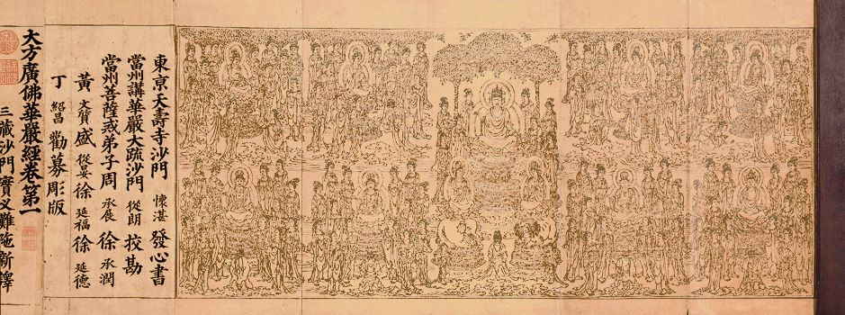

##  《菩提速道》讲记101（上） 

受 学 密法是应该要非常谨慎的， 受戒律更不是让你去违犯的。这一点是很肯定的，受持戒律就是为了让你好好地做人 ，为解脱做准备 。当初释迦牟尼佛制定这些戒律，都是为大家好， 是令大家依安乐而趣解脱的， 根本不是为你坏的。但是我们 很多人 现在真的不把戒律当回事儿了。前两天还碰到这种情况呢，一个 自称 学过密法且受了大量戒律的人，不仅吃海鲜，还在网上炫耀。 （ 顶差顶差，你也要瞒着不说才是啊！ ）真是一点惭愧心都没有！不可救药！ 

我对大家的要求其实也是这样，你们这一辈子不学密法我都觉得没什么，但是如果不把戒律持好，那就完全是自找苦吃。戒律没持好，那后面的东西学了都没意义。有意义吗？我觉得没意义。 增上生都没把握，决定胜的解脱道理你还远着呢！ 

**“因此，我当如理地修学戒法，”**

所以，大家 应该好好地做到持戒 ——戒为无上菩提本，长养一切诸善根 。 

《华严经》说： 

“若信恭敬一切佛，则持净戒顺正教； 

若持净戒顺正教，诸佛贤圣所赞叹； 

戒是无上菩提本，应当具足持净戒； 

若能具足持净戒，一切如来所赞叹！ ”

**“就算失坏生命也不舍弃自己如何承许的戒律。”**

你承诺的 戒律、规矩、承诺 ， 你就要去做到嘛 ， 要不然你承诺了干吗呢？前一天刚刚承诺好 ， 后一天就毁犯 ， 何必呢 ？ 骗佛？骗师父？骗自己！ 

**“如是思惟。”**

我们应该 这样想 、这样守护戒律 。 守护戒律不是为了师父，也不是单纯 为了不堕落，长远地来说， 是为了究竟解脱。 

**“无知是生起罪堕之门，”**

因为你在前面不学习，所以就会无知 ， 就不知道该怎么做， 所以无知 是生起罪堕之门 。 因此，首先我们就应该要学戒律。 

**“它的对治法是当听闻了知学处。”**

受了戒，就 应该知道这些戒律的内容是什么，不知道这些内容的话 ，你 学什么呢？ （这里的 “学处”指的是戒律。） 

碰到有些人，对自己奉持的戒律完全无知，更不论开遮持犯了，这样的情况，学生自己有很大过失，启蒙老师至少得负有部分责任。 

