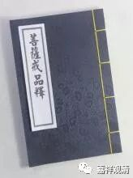

##  《菩提速道》101（下） 

**“放逸是生起罪堕之门，其对治法应以自为因而有惭，以他为因而有愧，生起正知正念有惭有愧后，住于不放逸。”**

放逸就是你没有用正知的心来观察自己嘛，放逸了，就过去了。这 有点 相当于什么呢 ？ 假如说美国所有的卫星都被我们打掉了，那我们不管做什么事情他就观察不到了 嘛。 我们的这个 正知 都被打掉的时候，那你的坏心在干什么 ， 你也不知道了，这就是放逸。所以我们应该努力地 升 起几颗卫星啊，比如说我们的北斗系统 —— 我们北斗系统是好的， 现在已经布局很多颗卫星了 。 

**“烦恼炽盛为生起罪堕之门，其中贪心的对治为修习不净观；嗔恚的对治为修慈心观；愚痴的对治为修习缘起观等。应励力于任何时候不令罪过沾染的清净戒律！惟愿上师天加持令我能如是而行！”**

其实在讲菩提心之前 ， 可能戒律真的应该年年讲 、 月月讲 、 日日讲，应该像阶级斗争一样牢牢地扎根在我们的内心深处 —— 以阶级斗争为纲。 

烦恼特别炽盛的话，有分别对治的方法：不净观对治贪欲，慈悲观对治嗔恚，缘起观对治愚痴，数息观对治散乱，界分别观对治慢 ……

**“由于这样的祈祷，观想上师天身分中降下五彩光明甘露，注入自他一切有情身心之中，自他一切有情无始以来所集的一切罪障皆得以净除，尤其净化了如是如是的障碍， ……，自他一切有情心中生起了如是如是的殊胜证悟。”**

这个大家不妨多修啊。不过呢，这个只是座上的修 ， 相比座下的修，可能座下的修在这方面更加重要 。所以 你应该要阅读相关的经典，听闻相应的教法，否则呢 ， 仅仅是在打坐的时候有一些概念，好像看电影一样。 

**“庚三、结行：如前所说。**

**己二、座间如何行：于座间也应当多阅读别解脱戒为主的学处等如前。**

**对于共中士道次的修心，于此讲说完毕。”**

出家的僧人就有很多戒律方面的书可以读了 ……

对居士来说，这有点麻烦，为什么呢？因为几乎没有专门讲五戒的经论。那么，在早期的阿毗达磨 ——《舍利弗阿毗昙论》当中是有专门讲五戒的部分，其他的经论当中呢，专门给居士看的关于五戒的部分是没有的。汉地是有一些专门讲五戒的论著的，比如弘一法师写的《南山律在家备览》，它更像是律学的著作，而不 很 具有实操性。这部作品更像是研究文献，大家有兴趣的话也可以看一下。 

菩萨戒部分对居士 是建议阅读的，推荐《瑜伽师地论 ·菩萨戒品》，宗喀巴大师、太虚大师都有解释。 

