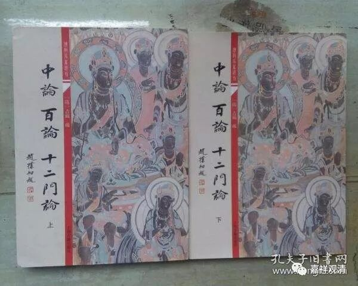

##  试论嘉祥吉藏三论《疏》的完成先后 

公元 602 年，隋仁寿二年，吉藏 54 岁，隋文帝杨坚敕吉藏撰《净名疏》 、《中论疏》和《十二门论疏》； 

此中《净名疏》即《维摩经义疏》，吉藏于公元 604 年，隋仁寿四年， 56 岁时撰成《维摩经义疏》。 

至公元 608 年，隋大业四年，吉藏 60 岁时，撰成《中論疏》、《百论疏》、《十二门论疏》，其中《十二门论疏》应该撰成最晚。 

《十二门论疏》卷中： “……《百论疏》已具明之。”则《十二门论疏》之撰成当在《百论疏》之后。而《中观论疏》最广，故最在前。 

《中论序疏》云： “予昔在江南寻之（僧睿所撰之《 < 中论 > 品目释》）不得，至京访问又无，当是失落也。”吉藏进京（长安）在公元 599 年，隋开皇十九年，吉藏 51 岁时。则《中论序疏》之作当在此后。 

《十二门论序疏》有云： “大业四年六月二十七日疏一时讲语……”《百论序疏》云：“大业四年十月，因讲次直疏出，不事访也……”则《十二门论序疏》之作在《百论序疏》之前。《十二门论疏》成篇在《百论疏》之后，而《十二门论序疏》撰成在《百论序疏》之前，如此，则三论《序疏》，乃各自独立于本论之疏而完成。 

这样，吉藏的三论《疏》和三论《序疏》完成的次序可能的先后顺序是：《 < 中观论 < 疏》、《 < 中观论序 > 疏》、《 < 百论 > 疏》、《 < 十二门论 > 疏》、《 < 十二门论序 > 疏》、《 < 百论序 > 疏》。 

三论注疏的最终完成是嘉祥吉藏大师创立（新）三论宗（之前称为古三论师）的标志。 

