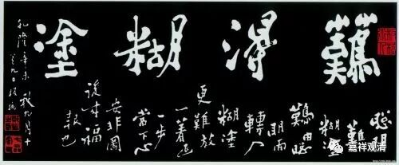
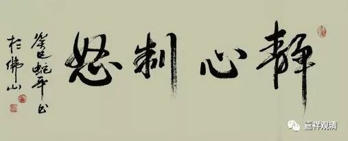

##  《菩提速道》讲记105（上） 

**“具德月称说：**

**‘若于菩萨生嗔恚，百劫积集施戒等，**

**一刹那间尽毁故，过恶莫大于不忍。’”**

这个嗔恚心 —— 不能够忍的心， 消耗福报、摧毁功德 是最厉害的了。想一想 我们都有类似 的情况。 前面的心是好的嘛，但最后一念的嗔心，前面的功绩就全部完蛋了， 再好的 布局也全部完了。 

下棋、打仗都这样， 阴谋家就调动对方的情绪，让他限于不理智的情境中，然后利用这种错误而战胜之 ……

**“当思惟嗔恚、忿怒的过患而遮止嗔恚。”**

大家想一想 ： “ 哎呀 ， 嗔恚心有多不好啊 ！ 哎呀 ， 我如果嗔恨的话，血压就容易高，所以更容易出现脑血管的意外 ， 大家看着也没有腔调 。 还有什么不好呢？将来也会有诸般的不好，报应也不好，所以还是不要恨了 。 ” 这样想的话 ， 嗔恚心会少一点。 不过，气头上，不容易压得下来吧。那需要一定的涵养功夫、正知的力量很强才行，而正知的 力量，是需要训练的。怎么训练呢？多修禅定咯 ……

不过，说起来平时做事的时候，有些人真的是 “蜡烛”。你跟他好好谈，这个事情真的完不成，你非要跟他拍桌子才行。你不跟他拍桌子，他不理你的。怎么办呢？先拍桌子再忏悔吧。你们还有其他办法吗？我不知道，你们有吗？ ……

**“另外，如前面中士道中无定过患时，所引《妙臂请问经》的经文，应念：‘不管对于怨敌、亲友及一般的任何一种人，也没有一成不变的，’”**

真的是哦，都 是刹那刹那在变化的。 怨敌变成朋友，兄弟反目成仇，乃至不认识的人相亲以后成为家人 ……可见 冤亲不定，所以，放下对亲人的贪执、放开对仇敌的怨怒吧！ 

