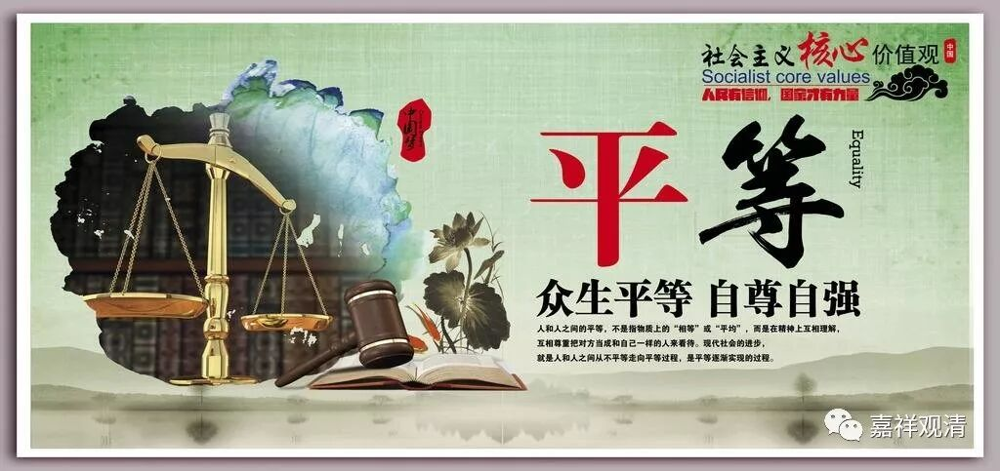

##  《菩提速道》106（中） 

**“于彼令心平等后，当缘一切有情修习平等心。其中道理者：是因为就一切有情方面而言，都同样地希求安乐而厌离痛苦，”**

所有的有情都要求离苦得乐，只是路走错了。 这个是必然的 。 有些人说不是这样的 ， 那你自己就要好好想一想了 。 我碰到有人说不是这样的 ， 但实际上肯定大家都是 “ 希求安乐而厌离痛苦 ” 的 。 有人举出一些具体的情况说不是这样的， 说有人就是自找苦吃 …… 那你再想想这些情况背后的动机 。 没有人 真正愿意自找苦吃的 ……

**“就自己方面而言，一切有情皆是六亲眷属，因此，不应落入两端，执某些为近亲而相饶益，执某些为远敌而相加害，应远离贪嗔亲疏，令心平等，惟愿上师天加持我令能如是而行！”**

放长历史来看，没有人 没做过自己的亲友（或是仇敌），所以，因为执对方是自己的亲友或者仇敌而产生贪爱或者嗔恨的心可以熄灭了 ……如果我失去理性，忘了这些教授而于有情中分敌我亲疏，愿佛菩萨加持我，令我此时能生起正确的对治心，熄灭不该有的妄执……

**“其后，从知母乃至菩提心之间的修习之理者，在顶上修习上师天的状态中，如是思惟：**

菩提心的 “七因果”教授是从“知母”开始计算的，之前的平等心是这里“知母”的因，没有平等心的话，“知母”以后的可能会流于贪心。所以先要修平等心。一般四无量心的次序应该是慈、悲、喜、舍，但因为这里的缘故，我们经常会看得到修习的仪轨里会把“舍无量心”提前。 

**（二）知母：**

**如《释量论》中说：**

**‘最初受生时，呼吸根觉等，**

**非不待自类，唯从于身生。’”**

《释量论》 这段 大家看看就算了 ， 我们学过现代医学的就不多追究了 ……

然后继续思维。 

