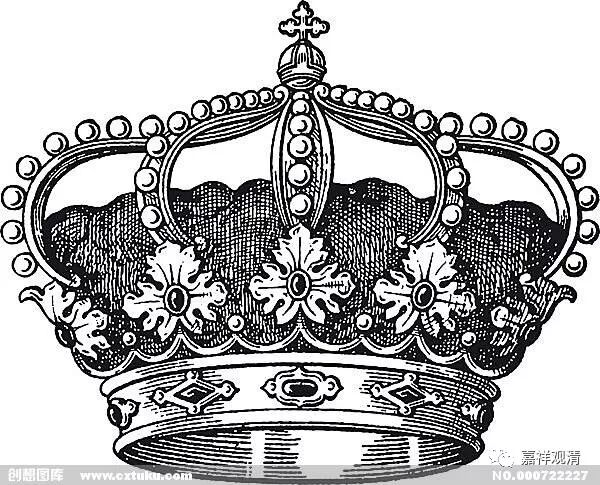

##  《菩提速道》109（中） 

**“（四）报恩：**

**如是念恩以后，修习报恩之理者，在顶上修习上师天的状态中，如是思惟：**

**从无始以来，这些深恩哺育过自己的母亲，由于心被烦恼魔所侵扰，六神无主，癫狂迷乱，远离了能观见增上生和决定胜正道的慧目，又无善知识加以引导，一一刹那，不能自制，造作恶行，步履颠蹶，游赴在生死轮回尤其是恶趣的可怖悬崖边。我若漠然地丢弃他们，实在是至为无耻下流之辈！为报答他们的大恩，我当把他们从轮回痛苦中解救出来，安置于解脱大乐中！惟愿上师天加持令我能如是而行！”**

据说，如果前面 知母、念恩 都能修起来的话，再修这个报恩就相对容易。 

**“（五）悦意慈： ”**

在宗喀巴大师之前 ， 对于到底是 与 乐慈还是悦意慈并没有一定的说法 ，在他之后 各个扎仓就有了自己的解读，然后就有关于是悦意慈还是 与 乐慈的各种说法，或者说什么时候是悦意慈 、 什么时候是 与 乐慈 。 大致有这样三种说法 ： 一种就是悦意慈，一种就是与乐慈，最后一种是 先修 悦意慈， 再修 与乐慈 ，在 不同的地方修。 

**“此后修习慈心之理者：观想一位自己深爱的人，如自己的母亲，对这位亲人而言，不要说无漏之乐，连丝毫的有漏之乐也没有。现今矜许为快乐的这些也都将会变为痛苦。虽然想求得安乐，历尽辛苦拼命营造的却是以后恶趣痛苦的因。”**

这个 真的 是我们所有的人都在这么做，明明想要获 得 快乐，但实际上所做的全都是痛苦的因。 

**“在这一生中，也是除了艰辛劳碌受尽痛苦之外，根本没有一点真正的安乐。因此，若能令这位亲人获得安乐和安乐之因该有多好！惟愿获得安乐和安乐之因！我当令具足安乐及安乐之因！惟愿上师天加持令我能如是而行！**

**这样祈祷以后，观想上师天身分中降下五彩光明甘露，等等。在于彼生起觉受以后，应缘于父亲等诸亲友而修，其次缘中庸之人，然后缘仇怨而修，最后遍缘一切有情如前修习。”**

这里 “ 遍缘一切有情 ” 的修法也是一样的，还是父亲在右边，母亲在左边，冤家在前面，恩亲在后面，然后六道围绕着。 

**“修习慈心的功德者：**

**据说，在此生中，若仅缘赡部洲修习慈心，将会成为统治赡部洲的转轮王；若缘二洲生起慈心，则成为统治二洲的铜轮王；若缘三洲生起慈心，则成为银轮王；若缘四洲生起慈心则成为金轮王；若缘三千世界生起慈心，则当成为大梵天王；若缘小千世界、中千世界生起慈心，则将成为小千和中千世界之主；如果缘尽虚空界的有情生起慈心，则其果报除了圆满的佛陀外，不会转成其他的。”**

我们看这里的话，又觉得密法在这方面就有道理了，把你放在那个位置的话就会是这样的情况。关于这个问题我是曾经想过的，现在这里面说的是，如果你对这些有情生起慈心，你就会生起相应的王位，对吧？但是，如果反过来讲的话，我觉得好像更有道理。对于绝大部分的人来说，假使你是一个有责任心的人，那么你站到这个位置上，你就会生起相应的利益大家的心。 

比如说，今天真的把你一下子提升为这个国家的第一把手，只要你不是 本质 太 差 的话，其实其他东西对你来说已经没什么大的意义了，你想做的真的就是利益他人。你在考虑的真的就是，这一个国境当中的这些人，怎么做才能对他们好 ，才能对他们有利益 ，你真的 会 为这一整个国境的人来考虑的。但是呢， 一般 社会大众是想不到这点的，他们可能还会觉得 国王总 是在那里享受，其实真的不是享受啊。 

