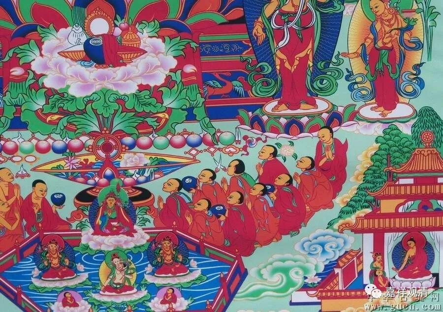
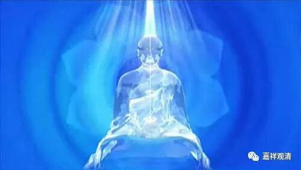

##  《菩提速道》112（下） 

**“一切酷热的痛苦皆得以息灭，住处也变为清净殊妙的器世间；放出无量的光明，犹如温暖的火和阳光，照触到寒冰地狱中的有情及其住处，寒冷的痛苦和住处的过失皆得以净除；又放出无量光明，照触到一切饿鬼及其处所，净除了饥渴、寒热、劳乏等的痛苦，悭贪及其所集的业障，器世间的过失也得到净化；又放出无量光明，照射到人中的众生和悬崖等器世间的过失，净除了生老病死颠沛流离等人中的痛苦及业障，器世间也转变为净土；又放出无量的光明，令非天中的斗争嗔恚嫉妒和天中的死殁下堕、遍行苦等皆得以净除。若如是观修，据说这也将成为修治自己于何处成佛的佛土的缘起。”**

就是自己为六道的众生多做种种利益 …… 这 也 是一种观想。 

**“略而摄之，如果依照《直授安乐道》中所说而行的话，在自成清晰能仁的境界中，胜解自己的身、受用、及诸善根成为五种光明甘露之相，施给一切有情，一切有情皆悉获得现前和究竟的圆满安乐。”**

这些都是观想， 至于这里 “度众生”的方法，实际的 身语的 行为 你还没有去做呢 ，这里 还只是观想部分 ！ 

我自己的智慧比较低， 实际到利益有情 时候我也不知道 具体 怎么做， 特别是有人希望师父能有一两句话把这么大的事情说完，哪我觉得除了泛泛地 “为利众生愿成佛”以外， 有时候真的不知道 怎么回答 ——具体的事情是千差万别的，哪有什么一两句话讲完的具体操作 。 

比如说前两天，他们有了五百万人民币，就在青海的草原上放了五百万人民币的羊，是吧？这个事情对当地来说到底时候利益呢还是破坏呢 ，我这个小资佛教徒就很迷茫 ？ 在我看来， 这个事情肯定是黑白业夹杂的了，到底是黑业更多一点，还是白业更多一点呢？我想大概白业会多一点吧，我也不知道怎么讲。首先，这件事情当中白业的部分，我们应该赞叹；而那些 “没脑子”的部分，我们应该呵斥。但是在我们现在的这个世界当中，要做到圆满，还真的不容易啊！ 类似 “凡是放生 都好 ”——我实在不敢说这句话。 

现在网上都在说嘛，随处放生是在破坏物种平衡。海南就是这样，把自然生态搞坏了，那些河流当中出现了入侵物种。这个其实不是我们佛教的做法，这个是民间宗教的做法，尤其是受到民间道教影响的民间佛教。那最好的方法是什么？是吃素吗？最好的方法，还是早早成佛 ！ 

你在 果上 做事和你在 因上面 做事是不一样的，就是我在果的后面做事和在因的前面做事， 这 差别就太大了！在因上做事，是在根本上做事，肯定最重要嘛！在后面的果上做事，怎么做都觉得很难。这个就像下棋一样，等到没棋可下的时候，怎么做都觉得非常难，总觉得有问题。如果你去学习佛法，然后去实践，怎么都不会错的，再不济你也会成为一名罗汉什么的。 

**“施给一切有情，一切有情皆悉获得现前和究竟的圆满安乐。**

**壬三、结行如何行，如前所说。**

**辛二、座间如何行之理：座间也应当参阅开示慈悲菩提心安立的经典和注疏。 ”**

我还是再提醒大家一下哦，南传的四无量心的修法，我觉得虽然不敢说很圆满，但还是值得赞叹一下的。大家可以去看一下， 内容 真的挺 丰富 的，至少就其内容而言肯定比这里要多。这里的内容是比较少的，文字并不多，实际上四无量心的内容挺多的。就其丰富程度来说，我一直怀疑，南传的这个修法 是否 可能 是阿底侠所传菩提心教授的来源背景 ——他去过金洲（苏门答腊），不是吗？（ 慈心悲心 应该加 上 两个 ——增上意乐和菩提心。 ） 

南传的四无量心，是针对四天下的众生而修的。虽然说四天下比三千大千世界小，其实你自己观想出来的也就这样，你现在观想的也只能是一些代表嘛。你要观一切众生的话，怎么观啊？真的是要无穷无尽地去观想了，还是找一些代表算了。 

四无量心 ——慈悲喜舍，在南传的《清净道论》里面讲得比较多，其他经典里面有没有更广的我不知道，那里面还有讲神通呢。《清净道论》目前有两个版本，在国内流行的是叶 均 的版本，还有一个版本是台湾翻译的。 

