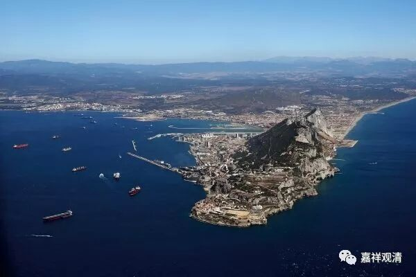

##  《菩提速道》113（中） 

所以啊，这个事情就是这样，在轮回当中的他能够想出一个办法来利益当时的有情已经很不错了。就像那天我在微信上讲的课，网上也有人提出一些意见，我就对他说： “你应该想清楚， 微信课程， 我要做的是直接利益 到 眼前听课的人 ，并不针对所有隐藏在后面的对象 。 ” 可以说，所有课程都是有针对性的。 虽然我讲的那句话对那个提意见的人来说可能不是很愿意听。 

我们可以很明显地看到，对 一个作者写作、 一个法师讲经 来说 ， 最重要的就是要直接 面对他的受众、 眼前 听法 的这些人，把他们搞定，不管用什么方法，能够让他们生起菩提心或者相似的菩提心，生起慈悲心或者相似的慈悲心，这才是最重要的。至于五百年以后的 张王李赵 能不能听懂这句话，不是他当时所想的，因为五百年以后还有观清师呢。 

我们相信将来的人会有办法解决这个问题的，就像之前我讲过的那位泰州的考古队长说的： “我们现在确实没有办法去发掘一些古墓，我们也知道现在发掘的话可能会造成一些伤害。所以我们现在基本上都是抢救性的发掘，比如说已经被盗墓了就马上去发掘。为什么这样呢？我们相信后人一定比我们厉害，他们会有办法解决氧化的问题，这些东西先放着，不急。” （ 所以五世班禅大师 估计 也就认为 的 ，以后的事情都交给观清法师吧 ——我还曾经这么想呢。 ） 

我们看这些文字性的东西， 包括现在的听课录音，实际 不可能要求 讲说者 能够像佛那样，做到 “一音说法，众生随类得解”，其实轮回中的事情都是这样。 讲课的时候是有情境、技巧的， 如果 单纯照顾到后进 ，那 尖子生 肯定会觉得 罗嗦； 而如果 单纯照顾到尖子生 ， 后进的学生 又会觉得： “他在讲什么呀？”比如说，你写的东西让知识分子看懂了，那么 一般 的人就会说： “观清法师这种人根本和我一点关系也没有。”但是你要是让 最末 的人都听懂了，又有知识分子会跑出来说： “观清法师，你讲的都是错的。”

我自己以前也挺轴的，听别人讲课的时候 心里嘴里 老是在批评： “哎呀！这段又讲错了，那一段也讲错的。这个师父根本不会讲经嘛。”可是当我自己讲的时候却发觉， 在通常的大众场合下， 根本没有办法真的 完全 按照 严格的 定义讲下去，否则 大部分 人将完全听不懂。那么，你是要他们 先 听得懂 一点 呢，还是要让五百年以后的 内行张王李赵 说你讲得 全 对呢？ 对付五百年以后的内行，就直接动手写专著吧。我经常说，落笔的文章和面向大众的普及讲座，大概至少得相差两个段位，我觉得佛陀说的 “世俗谛”和“胜义谛”、“说通”和“宗通”大致相当于通俗教说与核心观点。《楞伽经》说： 

“吾教法有二,教说及宗义, 

教说示童蒙,宗义为行者”

