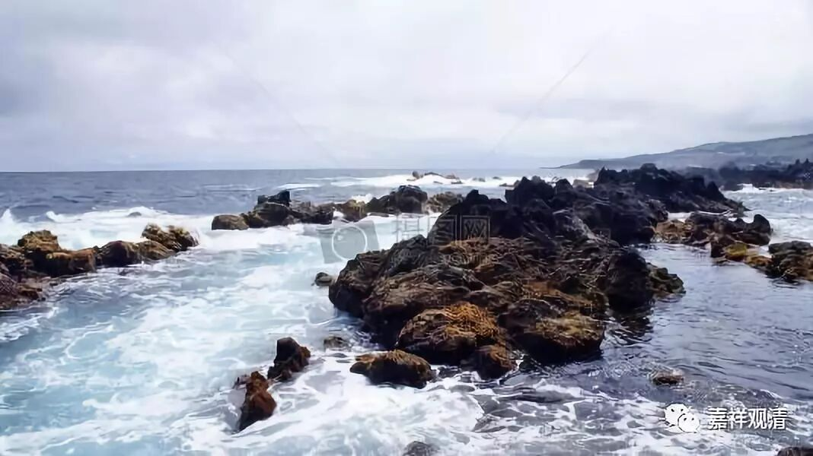

##  《菩提速道》115（下） 

**“因此，我爱执若未生起者，莫令生起，若已生者，当速断除。爱他执是一切功德的生源，若未生者，当令新生起，若已生者，当令增长广大。惟愿上师天加持令我能如是而行！等等。”**

修心教授里，我爱执这个很值得关注。但他在印度教典里似乎没有很明确的定义 ……

**“总之，能仁世尊舍弃自己而珍爱他人，所作所为，唯是利他，因而成就了圆满的佛果。我若也那样作，则早已成佛，由于没有那样作，至今还流转轮回。**

**我们的本师释迦世尊因地中生为长者‘亲和女’时，曾用脚踢了母亲的头，因而感得孤独地狱的异熟果报，在他的头上旋转着铁轮，他心中想：‘像我这样踢母亲头的不孝子还有很多，愿他们一切的痛苦都成熟在我身上！’这样想时，头上的铁轮却立刻消失在空中。**

**即在现在世间中，假如国王不以私利为主，而是把圣教、民众的利益放在首位，他们的话就会被大家奉为准绳，受到有识正直之士的称赞和随喜；而那些自私自利的人却会被人私下耻笑和憎恶。”**

这 种教法 还是我们所说的那种发明的教法，不是发现的教法。对当时的人来 ， 这样 讲 就够了。 

**“因此，只要我爱执存在心中之后，爱他执就不会新地生起，即便生起也不能维持长久。由此，不应生起珍爱自己、漠弃他人的心，应当舍弃自己珍爱他人。他人的一切痛苦和罪障取到自己心续上，自己的一切安乐和善根施给他人。我当令其他一切有情远离痛苦，获得圆满的安乐！然而如今自己不具有这样的能力，这样的能力谁有呢？唯有圆满正觉的佛陀才有。因此，我为了一切慈母众生的利益，无论如何也要证得圆满正觉的佛果！惟愿上师天加持令我能如是而行！等等。”**

自他相换，这里虽然一直在讲，但是并没有说到具体的修法。所以你是要去看其他的书再把具体的修法插进来的，或者你去问师父这里应该怎么修。具体的修法就比如把他人心上的黑色罪障都吸过来，到自己的心上，然后自己的功德从鼻孔里面呼出去，到达对方的身上等等，这里都没有讲。所以你想在一本书中很圆满地包括所有的内容，是不可能的。 

**“己二、以仪轨受持发心之理，分二：**

**庚一、律仪未得令得。**

**庚二、得已守护令不失坏。”**

接下去就是发心的仪轨。 

**“初者，在《道次第》中愿行两种菩提心是次第而受的，然而若依寂天菩萨之规同时受的话，则较为方便。其作法者：对于前行总的次第，尤其从依止善知识之理到发菩提心之间，一定要令正行的所缘与自心相合而修。”**

就是心里面要能够想得起来符合量的对境 ， 这个 叫 “ 正行的所缘与自心相合 ”。就是说 ， 你的心里要能够想得起来这个情况。 

**“此后，在顶上修习上师天的状态中，如是思惟：**

**我为了利益一切有情，必须速速证得圆满正觉的大宝佛果！为此，从现在起直至菩提藏之间，我当受持佛子律仪，修学广大的菩萨大行，为利一切有情，誓愿成就佛道！乃至未证佛果之间，永不舍离此心。”**

这个时候 要想各种办法把这个心生起来。 

**“这样思惟后，胜解自己随上师能仁念诵：”**

就是跟随前面的上师或者你 自己 的上师一起念诵。 

**“诸佛菩萨众，恳祈垂念我：**

**如昔诸善逝，先发菩提心，**

**复次循序住，菩萨诸学处，**

**我今为利生，发起菩提心，**

**复于诸学处，次第勤修学！**

**如是念诵三遍，在第三遍完结的同时，心中作得到菩萨戒体的胜解。此后念诵：**

**‘今生我具果，善获此人身，**

**今日生佛族，是为诸佛子！**

**自今我当为，宜乎佛族业，**

**无过最胜种，不令有染污！’**

**如是内心发大欢喜。”**

这个就是比较短的 愿 菩提心和行菩提心都有的 仪轨 。 在大乘长净戒的受持仪轨里面也有的。那么，基本上所有的仪轨当中都有，都是按照这个来的。 

今天 先到这里吧。 

