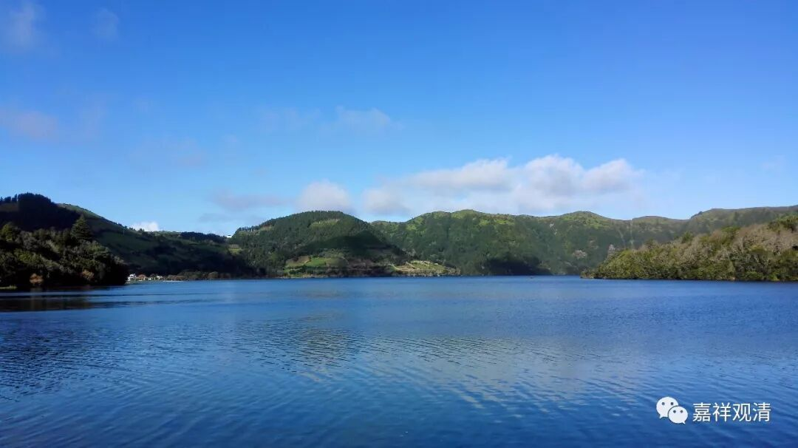

##  《菩提速道》讲记116 

好，我们继续《菩提速道》，已经到了上士道的内容了，第 74页。 

**“如是内心发大欢喜。”**

这个是发愿菩提心，后面就是发行菩提心。 

**“庚二、得已守护令不失坏：**

**在顶上修习上师天的状态中，如是思惟：为了利益一切慈母有情，无论如何我当速疾证得圆满正觉的大宝佛果！为此，应当思惟菩提心的利益，昼三次夜三次地受持菩提心； ”**

那么，这里的意思就是早上三次、晚上三次受持菩提心。 

最简单的受持方式就是把 “诸佛正法贤圣三宝尊 …… ”念三遍。在有些仪轨当中，也会有菩提心相应的部分。比如大乘长净戒的仪轨当中，就有受菩萨戒的部分，那个总共是八句。 

简单的就按照我们前面讲的， “诸佛正法贤圣三宝尊，从今直至菩提永皈依”，这个是皈依，“我以所修施等诸资粮，为利有情故愿大觉成”，这个就是发心了。这里是说昼三夜三，但是如果你一早上就把六遍都念完了，也是可以的，反正你总的就是每天六次嘛。 

这个事情呢，我总觉得坐长途飞机的时候就有点头大 （主要是因为 我的脑洞有点大 ） ，到底应该怎么算呢？有时候就索性多念一遍。在那种要飞八个小时，甚至十几个小时的情况下，有时候越过国际日期变更线了，到底该怎么算呢？今天的念完了，诶？昨天的没念。或者是昨天的念了，诶？怎么今天又要回过去再念一遍？ （哈哈哈哈，祖师们没考虑过国际日期变更线吧  ……） 我曾经想，像祈竹仁宝哲这样满世界飞的时候，这个事情不知道他是怎么解决的。绕地球一周的时候，会不会就少念一点？ 估计与其少念，不如多念 ……

**“无论有情本身行为如何，我也终不舍弃一个有情！”**

这个 精神实在 太厉害了！菩萨真是太伟大了！ 

**“为了令菩提心增长广大，应修供养三宝等善行，精勤地积集二种资粮。**

**菩提心的利益功德者：相续中具有菩提心的补特伽罗，会有两倍于转轮王的护法守护；非人纵然恶毒也无机可乘；其他补特伽罗不能成就的明咒，具菩提心者却可以迅速地成就；彼补特伽罗所在之处，没有瘟疫和饥荒等，即便发生也很快息灭；彼补特伽罗成为一切世间人天等众礼敬供养的对象。 ”**

这个呢，是书上这么说的，实际情况 就那啥了（我的眼睛 至少现在还 是凡夫的配置） …… 否则的话 藏区 就应该是五谷丰登、眷属美满 ，因为 “**相续中具有菩提心的……补特伽罗所在之处，没有瘟疫和饥荒等，即便发生也很快息灭**” 。当然，他也可以这样 回 ： “本来应该是这样的，但是你们的福报不够，就表现为不能有这样美满的共业。”这样还是能说得回去的。 

