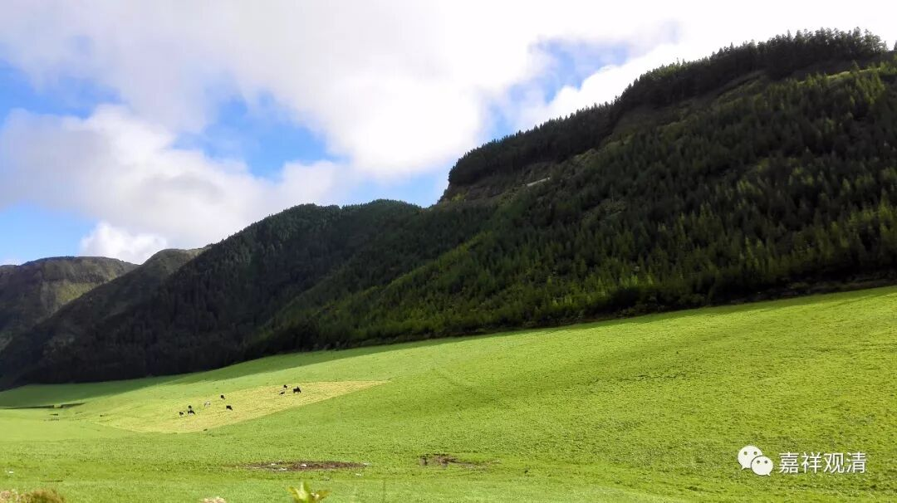

##  《菩提速道》117（中） 

**“总之，直至菩提藏之间，”**

这个 “菩提藏”的问题，我们就需要好好学习梵文了。据哪位大师说的——我已经忘了是哪位“登大师”，估计是巴登 师 吧， 提出 这个 “菩提藏”实际上是指 “ 菩提场 ” ，就是 释迦菩萨 成佛的地方，就是菩提伽耶， 也 就是 释迦太子 成菩提的地方 ——菩提场。 

“直至菩提藏之间”，就是直至你要成佛之前的意思。华严宗不是要唱的嘛？这个就是菩提场，就是佛到了那里在菩提树下成佛，这个地方叫菩提场。据说这个“菩提藏”呢，转回梵文的原文，很明显就是菩提场。 

这个有道理啊！哎呀，什么时候请大师教梵文啊？要不然江湖上没法混了。写论文的时候不蹦出几个巴利文、梵文，自己都觉得这篇论文不好意思往外说啊。还好这次我的论文是关于民间宗教，连参考文献都没有。 

**“总之，直至菩提藏之间，”**就是从现在一直到成佛之前。**“应当清净守护菩萨戒，”**那么，到了菩提场之后呢，你怎么做都是对的，是吧？**“乃至舍命，任何时候亦不令十八根本堕及四十六种恶作罪沾染！惟愿上师天加持令我能如是而行！等等。”**

这个 “十八根本堕”和“四十六种恶作罪”，是菩萨戒。这里的注解写的是“瑜伽部菩萨戒”，实际上应该是指向《瑜伽师地论》的《菩萨戒品》当中的菩萨戒。在其他地方基本上只承认《瑜伽师地论》当中的菩萨戒。 

那么《瑜伽师地论》当中的菩萨戒呢，它是包括四重和四十六轻。有些说四十六，有些又合为四十三、四十五，也有说四十七、四十八的。在西藏主要依据是月官论师的《菩萨律仪二十颂》当中的，有 “四十六种恶作罪”。 

根本堕呢，本来是四重，然后又加了十四个，变成 “十八根本堕”。这十四个是哪里来的呢？是《虚空藏菩萨经》当中的。其实《虚空藏菩萨经》当中所说的，远远不止十四个，合并同类项以后就变成了这十四个。这个是宗喀巴大师抉择的，所以后来基本上都是按照十八重——“十八根本堕”和“四十六种恶作罪”来说的。这里的“恶作罪”就是恶作的意思。在《百法》里面有一个恶（wù）作，是悔的意思，应该念恶（wù）作。这里的“恶作罪”就是恶（è）作。 

