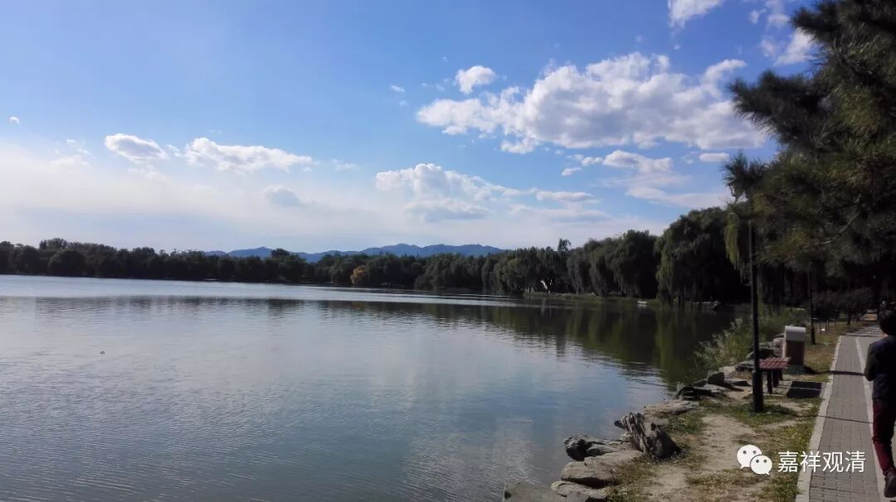

##  《菩提速道》讲记118（上） 

还有 这里的 “惟愿上师天加持令我能如是而行” ， 大家看到整篇里面都是这样 的话， 好像这 句 是最重要的 。 其实这 只 是仪轨的一部分 ， 最重要的是你自己修行的那部分。然后 ， 在你修行 得 比较累 的 时候 ， 再观想上师本尊降甘露，或者是你自己能力不够的时候，心比较弱的时候，请上师本尊加持。要不然的话 ， 整个道次第 就 变成不是修行， 而 是菩提道次第祈祷成就法了。 

大家要知道 不是 这样的啊。 道次第当中 ， 包括佛教的其他内容当中，当然会有这些祈祷的部分，因为宗教发展到一定程度是一定会有祈祷这部分内容的，但是 真正的 核心还是要自己修行，这些内容都是要自己去实践的。修行了以后，觉得自己累了，就观想一下 ， 或者是自己能力不够了，准备喊 “苍天啊、大地 啊 ”的时候，就应该观想菩萨降甘露灌顶。 

**“戊二、发心后修学菩萨行之理，分二：**

**己一、修学总菩萨行。**

**己二、别学后二种波罗蜜多。”**

总菩萨行包括六度，是吧？已经习惯地用六度来说总菩萨行了。那么，在六度当中是包含了禅定波罗蜜多和智慧波罗蜜多的。按照《菩提道次第广论》的写法，是在讲完六度之后重新再讲一遍止观的，所以其他道次第的论著基本上都是根据《广论》的习惯，把六度讲完以后再别说后二度的止观部分。 

**“初者，分二：**

**庚一、座中如何行。**

**庚二、座间如何行。”**

修行就是分两个，一个是座中，一个是座间。 

**“初者，分三：**

**辛一、加行。**

**辛二、正行。**

**辛三、结行。**

**初者，加行：**

**‘遍摄依处上师殊胜天，能仁金刚持前诚祈祷’等以上部分同前，”**

这里也是一 样的 ， 如果简单 点 就念 《 菩提道次第成就盛宴 》 ，或者是 《 乐道 》 的祈祷文当中正行前面的部分 。 最后这一段就是 “ 遍摄依处上师殊胜天，能仁金刚持前诚祈 祷 ” ，这个是正行部分 的 开始。前面所修的 内容 和最初的道前基础当中所修的那些内容都是一样的，所以就不 多 说了。 

