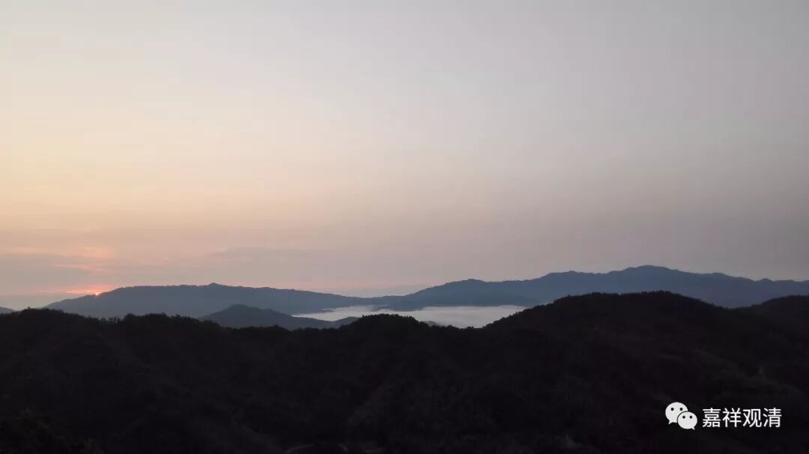

##  《菩提速道》讲记119（上） 

我觉得这个和他们长久的习惯有关，他们一直对钱财的来处不太追究。我看到好多法师都有这个情况，就是对钱财的来处不太追究。就汉地来说，可能是因为汉地本身的文明比较发达，会讲究所谓的君子和小人之分，如果钱财的来路不明的话，一些比较知名的寺院和一些比较厉害的法师都是不接受的。 

**“如《菩萨别解脱经》中说：‘舍利子，善逝未开许诸出家众以诸财物而行布施。’霞热瓦说：‘我对你不说布施的功德，而说执持的过患。’”**

对于出家人，师父就不再多讲布施方面的问题，但是会和他讲负面的吝啬、悭吝等过患。 

不过，具体的行为还是要看发心，要看动机。本来按照这些道理出家人是不应该做蓄积的，经典当中也是这么说的，说出家人尽量不要蓄积，如果有可以布施的财物的，就应该尽快地布施。但是呢，又有一些比较现实的情况出现，比如说 考格西 的实际情况，你如果不蓄积的话，等到考头等格西的时候根本就没钱布施了，而且好像还是要蓄积很长时间的。甚至当师父的为了自己的弟子们 考格西 也要蓄积 财物帮他们做布施 的。在 那里 还有这样的习惯，一些比较大的寺院当中，假如你做这一年的法台，那么这一年当中 假如 四个重要的法会，都是由你出钱的，要由你来负责 …… 总之实际情况可能 就不得不去蓄积。 

我曾经碰到过一位法台，他是 某 寺的密院的法台，口碑很好，学问也很好。 寺主大师 就问他： “你的情况还比较麻烦，那今年的这几个法会你准备怎么办呢？拿什么钱来解决呢？”那位法台脱口而出：“很简单，我把房子卖了呗。”于是， 寺主大师就 非常高兴。 

然后， 寺主大师 又去问另外一位药学院的法台，当时这位法台还是一位格西，学问也很好的。 “那你呢？今年法会的供养，你准备怎么办呢？”那位法台回答说：“我们药学院呢，下面有两个部落，我准备抽人头税。每个人抽 若干 钱，我们就可以供养僧众了。 ” 寺主大师就批评 他了： “现在和以前不一样，这种事情不要做，这个是不应该的。”

当然了，你真的这么 收人头捐款 的话， 部落里的那些 人是很愿意的，他们觉得供养法会是很应该的事情。但是 寺主大师 就会很不高兴： “你这样做是不对的，现在的情况和以前是不一样的，这么做不好。”然后就表扬了前面那位准备卖房子的法台：“嗯，你的想法很好。你房子也不用卖了，需要多少钱，你来找我要吧。”所以后来，那位密院的法台的口碑就非常好。 草原上的人 喜欢唱民歌、编民歌，或者类似 有 这样的事情， 可能本身就是和尚中间有文化的人写了，然后传了出去， 就把这位法台称作 “ 经文 多多钱少少 ”，而另外一位格西呢，就 被讽刺为 “ 经文 少少钱多多 ” —— 把这两个 人的行为 进行对比。 

