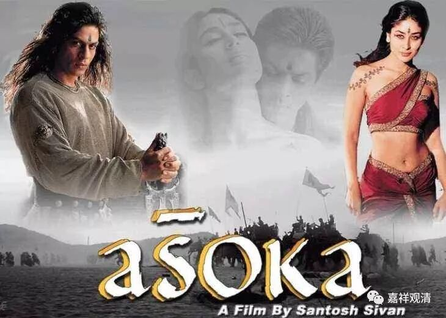
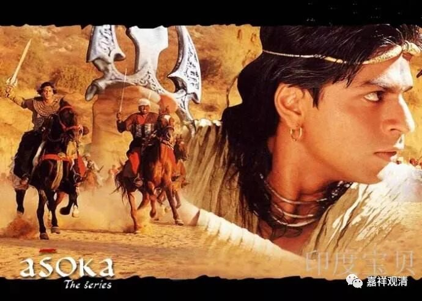
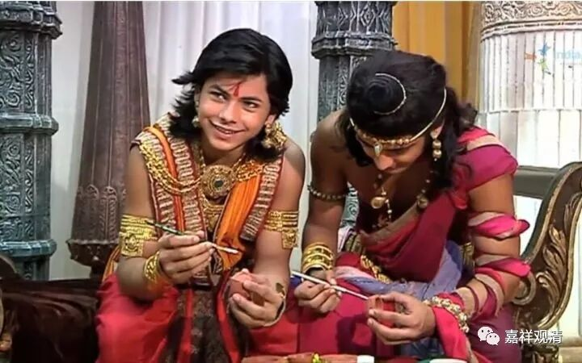

##  《菩提速道》120（中） 

**“若心想：‘如果布施了受用财物，自己就会变得匮乏，因此不能布施。’**

**应当想到：即便现在不布施，然而一切的身命财物就像水中的泡沫一般无常，”**

这还是在对功利的人讲哦 。 

你以为你死去了以后这个钱 还 是你的吗？你一块钱都带不走的。今天你布施掉了，还会在你的福报里面存起来，是吧 ？ 所以 ， 能布施就布施吧 ！ 你真以为你的这些钱能带 得 走吗？对一般的人都会这么讲嘛 。 这个大部分还是有点功利的形式来劝 说 的 。 “ 然而一切的身命财物就像水中的泡沫一般无常 ” ，你不戳破它，它自己都会破。 

**“终有一天，一定要舍弃！虽同是舍弃，若现在施舍，在诸后世中，自己至少也会得到百倍的回报而不会贫穷。如是思惟而行布施。”**

有一个故事，我也不知道是真是假，但是也有可能是真的哦。阿育王在临死的时候，还在想对僧团进行布施，是吧？但那个时候，他儿子已经控制了整个王国，阿育王自己已经没有权力了。最后，他把他自己吃的半个 余甘子（酸果） ，作为对僧团最后的供养。在那种情况下，他还是准备供养。 （ 他这是被谁洗脑的啊？太厉害了！ ） 然后 目犍连子帝须 ， 就 把僧众全部召集起来，把这个 余甘子 供起来了 ，说 —— 这个就是 “法阿育”最后的供养。 

阿育王在 他执政 前期的确是暴君，但是 “法阿育” 时期 已经不再是暴君了嘛。你看电影《阿育王》里面，他发动战争有他的理由，有他的想法。他的出发点是统一印度之类的，他自己觉得很正义，只是到后来他发现自己做错了。在战场上竟然有这么多的死人，本来自己是想利益他们的，结果却发现： “我造成的伤害居然这么大！我这个人怎么这么坏？”这个时候他又看到了有 沙门（现场有佛教的 出家人 ） 在，突然之间就反省过来，从一个暴虐的阿育王变成后世称为叫 “法阿育”的人。 

当然，后来就有一个说法，说有两个阿育王。实际上是一个人，是他的心态转变了。他本来是想利益大家的，而我们今天欧盟的统一，实际上是大家通过谈判来实现的，而他当时没办法通过谈判来统一，就决定使用武力的方式来统一，也是想实现利益的最大化。结果呢，他虽然想带给大家利益，在战场上看到的结果却是文明遭遇涂炭，就发现是自己错了。 

接下去他改用的方式就是用佛教来传播文明，他的一个儿子和一个女儿都出家了。有一种说法是他弟弟出家，另一种说法是他儿子出家，斯里兰卡的佛教就有说是他的儿子 摩哂陀 传过去的。 

经典里记载说 ， 阿育王 前世，在佛陀时代，当他 还是个孩子的时候就把土放到佛的钵里面 供养，佛授记他以后做印度的转轮王 …… 按照这个习惯，是不是以后我们也要把那沙子放到钵里面去供养呢？当然不是哦，我是开玩笑的。 

有个印度电影《阿育王》，大家有兴趣的话可以看看……

