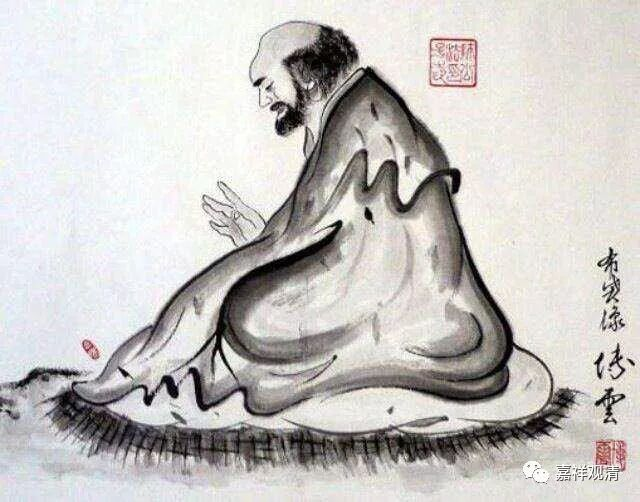
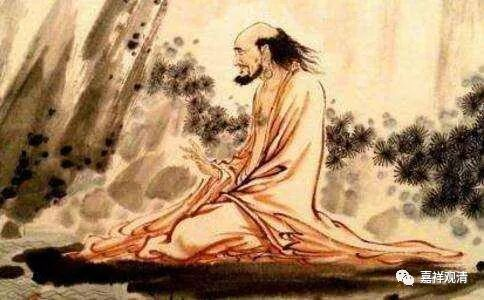

##  《菩提速道》120（下） 

**“如是思惟而行布施。”**

这 种 “ 如是思惟 ” 是比较功利的 一种 ，但 是他仍然是在劝你布施的。 

对我们来说，应该慢慢慢慢地把这种功利的思维过渡到道德的思维，变成 “这是我应该做的”。 一般的 这种对自他都好的思维方式，还是有点接近功利的。 

应该怎么思维呢？ “就该这么做！”你在修行当中有很多苦行，可能对自己现在的利益或者是短期内的利益都看不见，而且是很痛苦的，但这些也都是应该做的，我们要看长时的结果。 

**“如《入行论》中说：**

**‘一切终顿舍，施诸有情胜。’”**

你死的时候 ， 一下子就没了嘛 。 你 都 管不住了 ， 还不如布施给其他人呢。 

**“《本生论》中说：‘施得珍财藏。’**

**另外，阿底峡尊者说：‘来世较此世长得多，为了来世的路粮，当把珍宝埋藏到宝藏中。’”**

这个宝藏，就是指三宝 。埋藏到三宝当中， 对吧 ？ 或者埋藏到众生当中，埋藏到佛的 无尽的 事业当中。 类似于，放在佛陀信托、三宝信托、 有情信托里面，这样就永远不会用尽 ……

**“帕当巴说：”**

帕当巴桑杰 ， 是印度的一个 祖师，事迹 和 我们的 达摩很像的人。 在 某地（ 你懂的 ） 他们说帕当巴就是达摩。 他们 的考证就是这样 简单： 这 两 个人的行为很像，所以这 两 个人就是一个人 。实际上 这 两 个人所处的时代要相差至少四、五百年 ， 对吧 ？ 

达摩是什么时候啊？达摩是在唐代以前，在南北朝的时候啊 ，梁代时见过梁武帝 。帕当巴桑杰是在什么时候呢？帕当巴桑杰 是 在阿底峡尊者的那个时 代 ，大概相当于内地的宋代，公元 1100年或者1200年左右。这中间差了多少年啊？六、七百年都不止。 某地 说这两个人是一个人 ……传说和历史还是分不清啊。 

