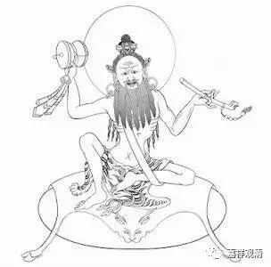
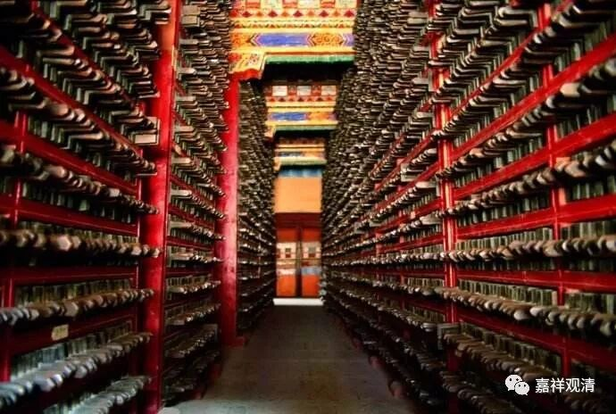

##  《菩提速道》讲记121 

这位 帕当巴桑杰 还挺有趣的，他和米拉日巴两个人进行斗法，看谁的本事大。比试的结果是两个人的水平差不多，但是在最后呢，帕当巴桑杰就站到一根草尖上去，然后米拉日巴也站到另外一根草尖上去，那跟草尖就往下弯了。 

帕当 巴桑 杰就以战胜者的姿态说： “实际上我们的水平是一样的，但是因为你的种姓问题，你站的草尖就往下弯了。而我的种姓比较高，从小就是吃素的，草尖就不会弯。” （不过，这个是不是信史则 ……） 

帕当巴桑杰到藏 地 去过两次，后来西藏有两个比较重要的派别可以说都是由他传承下去的，早期有一次，后面又有一次，一个叫希杰派，一个叫觉域派。这两个派别现在基本上都不 以独立宗派的形式 存在了，有的人说自己是这两个派别的，但实际上 独立的 派别已经不存在了，传承则是在格鲁派 等大宗派 当中流传下来了。 

在希杰派和觉域派快要灭亡的时候，那两个派别的人特别少，快要断传承了。那个时候，二世 嘉木样 大师 有一位弟子叫索南智华，是拉卜楞寺 系统 的一位大格西， 当时 他在三大寺学习，水平非常好，当时是准备要考头等格西的。二世 嘉木样 活佛就给他写了封信，对他说： “你就别考头等格西了，没你的事。你现在去到西藏南面的XXX，把觉域派的 断 法都学过来。 ”

索南智华格西接到信就走了，把头等格西 的名位 弃之如草芥。他来到西藏南部，就学习了觉域派最主要的断法，学完之后也就不再回拉萨，而是 直接回到了甘南 。后来索南智华 —— 简称也叫 索智堪布，在拉卜楞寺大经堂的右后方，建造了一座大白伞盖殿，他后来也做过拉卜楞寺的 总 法台 。 

就这样，帕当巴桑杰所传的 觉域派快要失传的法，是二世 嘉木样 大师派他的弟子去继承下来，然后带回了拉卜楞寺。 

二世 嘉木样 大师呢，是一个非常接近于现代学术思维的人（难道是穿越回去的大师吗？）。他在 藏区 这样的环境下， 他有 了建造图书馆的愿望，而且收藏了很多类似于民间的或者不同版本的书籍，这 种思路 在 三五百年前 的 藏区 是很少见的。他自己到处搜集了很多书籍，都在拉卜楞寺保留了下来， 还搞了刻经院，给桌尼版大藏经写序言、提要 ……他还分 派了他的弟子到各个地方去 接受 传承。拉卜楞寺就在第二世嘉木样大师的时代又有这种新的发展。实际上每一世的拉卜楞寺的 寺主大师 都有他们与 前任 不同的特点。 

那么，觉域派比较重要的法就是大家经常听到的这个 “ 断法 ” 。觉域派和希杰派都属于小派别，是帕当 巴桑杰 两次去 藏区 分别留下的传承。 

