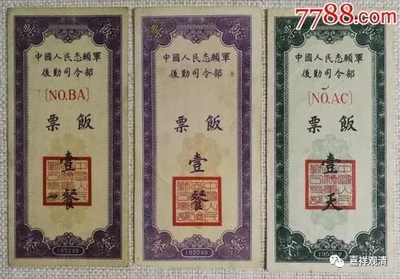
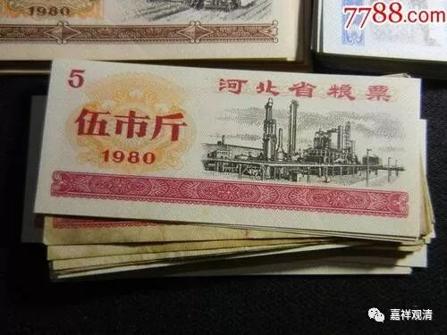
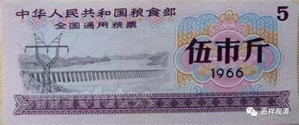

##  《菩提速道》121（中） 

**“帕当巴说：**

**‘友中多已赴后世，有路粮否？定日人！’”**

这是祖师帕当巴说的一句有寓意的话。这里的 “定日”应该是一个地方。 

“朋友当中很多人已经去了下一世，怎么样，你准备好了（去来世）路上的粮食了吗？” 这句话说的情况就是自己的朋友当中，很多都已经不在世了 ，那么，你该想想，你准备好了吗？ 所以有时候我会想想，假如这种情况发生了 （ 我不知道你们怎么样 ，我觉得挺凄凉的） ，假如真的老到这个 地步 ，所有 同龄的 有朋 都不见了， 就你一个人在那里念旧 —— 也挺惨的哦。 

和我们相差十岁的 八零后们 ， 相处之际， 已经觉得有严重的代沟了 （现在据说三岁一个代沟） 。如果 等到 我们的牙齿都快掉光的时候，在我们面前的是和我们相差 了 将近半个世纪的人，思维方式完全不一样的，和他们怎么也聊不到一块去啊！那个时候 …… 可太惨了。 

**“有路粮否？”**

你路上的粮食准备好了吗？（如果是二十年前的话，那会问：“准备了粮票了吗？”去外地还要问“准备好全国粮票了吗？”） 你准备好了资粮了吗？！答案可能有点惨。**“定日人！”**你我都是那个被问的 “定日人”。 

**最好是在菩提心的摄持下，中等应在厌离整个轮回的出离心，最下也应希望增上生中不乏受用，在这样的意乐摄持下努力修行布施。 ”**

那么，布施的心可以有这样几种，各种情况都可以有的。**“最下也应希望增上生中不乏受用”**，指的是 ，作为修行人来说， 最差你也应该要为下一世的利乐来布施。如果你仅仅是为了今世来布施，那么畜生也会有的，它们也懂的，所以这里的 “ 最下 ” 至少也得是希望后一世不乏受用。 中等的要准备解脱的资粮，上焉者则当以菩提心的利他来摄持。 

