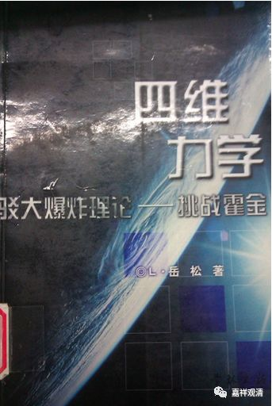
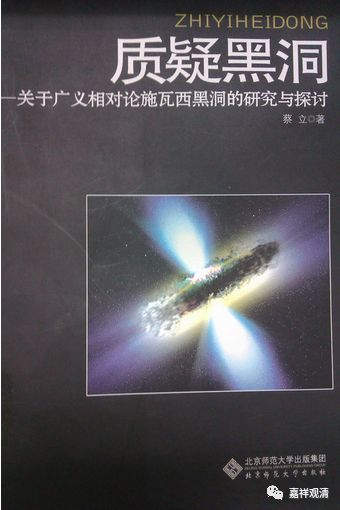
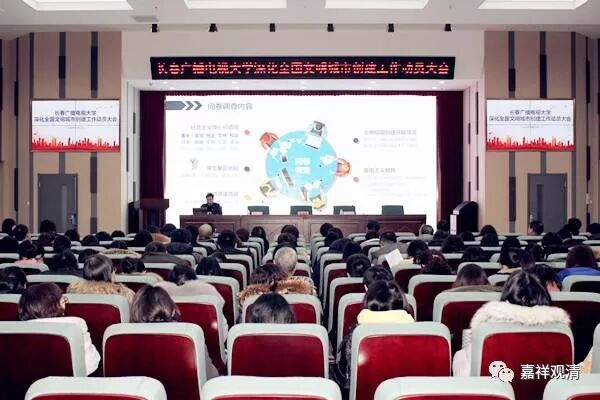

##  《菩提速道》123（中） 

**“（四）修习精进波罗蜜多：”**

这就是于善法而努力，对吧？ 

**“其后为精进的修持，在顶上修习上师天的状态中，如是思惟：为利一切慈母有情，无论如何，我当速疾证得圆满正觉的大宝佛位！**

**为此，为成就相好等一一佛法和布施等一一菩萨法，即令八十中劫合为一大劫，一千大劫为一昼夜，三十昼夜为一月，如是十二月为一年，必须在一一十万阿僧祗大劫中，住于无间地狱中方能证得佛果，我亦不舍精进，生大欢喜！”**

这些话我们基本上都能背出来， “哪怕是为了一个众生得解脱，哪怕因此无量劫在 地狱中受苦，我愿承担！ ” 但是真的要这样去做，太难、太难了， 好好想想，真实的 菩萨真是太伟大了。哪怕一刹那，对我们来说都很难做到，更别说这么长的时间了。 菩萨发心真是不容易，实践更不容易，现在在江湖上我们看到满满的都是 “菩萨”，真是又期待又无奈——假如有一种 研究叫 “民科”，有一种大嘴叫“民哲”，那比这两个群体加起来都要更多的是“民佛”……

**“若心中想：‘我没有能力这么长时间地发起擐甲精进呀！’”**

下面就开始 劝导 。 

**“如果我们已发大精勤修心于三士道次第，并且善加修习了自他相换之心，由于断除了十不善的恶因，身体不会产生痛苦的果报；又善巧通达了一切法无自性之义，心中也不会生起忧恼。身心安乐增长，法喜充满，虽长处轮回又怎么会使我们怯懦、疲厌呢？”**

问题是，前面的这些我们都没获得嘛。 

**“如《入行论》中说：‘恶断故无苦，善巧故无忧。’”**

精进如斯， 对四地以上的菩萨肯定没有问题了，对于今天的我们 …… 就尽力而为吧。 

**“又说：‘乘菩提心马，由乐复至乐，有心谁疲厌！’”**

对这些发起菩提心的菩萨来说，实际上由于因果的关系（以愿力而去地狱）在下面他是不受苦的。（但是，这里文字 ——即使无量的时间处在地狱——的意思是本来是有苦的啊。说着说这好像意思变了……）只要我们有了菩提心的摄持，这一切便不是业感的苦，安乐的因 必然会得到安乐的果。 

**“此外，自己的所有善根，无论大小，都已为了成就一切众生现前和究竟的广大利乐而至心回向，依于每一位有情都可获得那样众多的福德，加之诸佛菩萨的加持，更令增长无穷。依此可以顺利地圆满二种资粮，所以无须怯懦。**

基于无量的众生、远大的目标、无上的加持，所以可以速速圆满资粮，无需退怯。 

**如《宝鬘论》中说：**

**‘所诠诸福德，若令有形色，**

**恒沙诸世界，亦非可容受，’”**

这一段文字在很多地方都可以看到，有的是 “布施福有色……” ， 也是不得了的 ， 是吧？或者 “菩提心有色……” ， 也是不得了的 。 那么 ， “忍辱福有色……” 和 “精进……”也都一样。 也可以这样思维。 

**“此世尊亲说，其因亦显然，”**

这不是我说的，是世尊说的。这个道理也很容易看 得 到。 

**“有情界无量，利乐心如之。 ”**

有情是无量的，所以我们利乐有情的心也是无量的 ； 这个精进的心是无量的，显然最究竟的福报也是无量的。 

**“因此，应把甚深广大的善法摄受于自己的心中，将他人也安置于善道直至获得无上菩提！惟愿上师天加持令我能如是而行！等等。”**

自己这样观修，然后再观想顶上的上师放光加持自己。 

