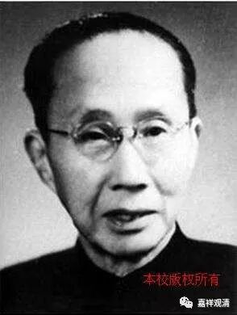

##  《菩提速道》123（下） 

**“（五）静虑波罗蜜多：**

**其后为静虑的修持，在顶上修习上师天的状态中，如是思惟：**

**为利一切慈母有情，无论如何我当速疾证得圆满正觉的大宝佛位！因此，我应修习佛子无量无边的一切种禅定：从体性分有世间与出世间静虑；从品类分有寂止、胜观，以及此二双运的静虑；”**

就是止 、 观和止观双运的静虑。 

吕澂 先生在他的著述当中说宗喀巴大师没有把静虑分为寂止和胜观，他的意思就是止观都是属于禅定的一部分。他认为宗喀巴大师没有这么说，其实包括《广论》等道次第的论典当中都提到了。应该说是 吕澂 先生当时可能没看到或者没注意到这方面的内容。他可能看到的是， 在 六度当中分别开 出了 定和慧，然后在很多地方都把止和观与第五 、 第六波罗蜜多来相对应 。 可能从这方面来看 ， 他觉得宗喀巴大师并没有认识到止观二者都属于定学。但是在静虑波罗蜜多的方面，可能 吕澂先生 没注意到， 实际上宗喀巴大师是 提到了。 

**“从作用分则有身心现法乐住静虑、引发功德静虑、饶益有情静虑三种。”**

这 些 呢，都是《瑜伽师地论》里面的。《广论》 以及 相应的 一些 教法当中，大量地引用了《瑜伽师地论》里面的内容。 

还有一 点 呢，就是前面有些地方 讲 六度的时候是分了三种，比如布施分为财施、法施 和 无畏施，然后《瑜伽师地论》是每一个都给了三种，那么大家背起来比较容易，科判起来也比较容易。 换一种 分法的也可以的。 

大概是 00年或者01年的时候，苏州西园寺第一届考试， 我自己没 答 出来，还在那里叫嚣 。当时有一道题目，说到戒分三种：定共戒、道共戒和律仪戒。考完以后我就 提出质疑（ 不会做人啊，所以人家不愿意要我 ） 。我说： “这题目出错了。”当然，我挑了他们很多错哦，这道题目也说他们出错了，结果被他们顶回来了 。定共戒、道共戒和律仪戒，是有这种分法的，他们一说，我发现，对的，有这种说法的，有这种分法。其他的题目 ，我一直说他们出错了 （当然也确实错了，哈哈） ，结果就得罪人了嘛。 

**“惟愿上师天加持令我能如是而行！等等。**

（六）**般若波罗蜜多：**

**其后为智慧的修持，在顶上修习上师天的状态中，如是思惟：**

**为利一切慈母有情，无论如何我当速疾证得圆满正觉的大宝佛位！因此，我应修学通达究竟真理的胜义慧、通达世间五明的世俗慧，”**

这个又是《瑜伽师地论》里面的 ，胜义慧、世俗慧 。 

**“以及通达利益有情的饶益有情慧等一切种佛子智慧。惟愿上师天加持令我能如是而行！等等。”**

六 波罗蜜多 里面的 后二度 是 别开的，所以第五和第六度就讲 得 比较少。在《菩提道次第广论》当中也是这样的，第五 、 第六度相应的展开不多， 在 后面又继续展开 ，单独讲止观 。 

般若波罗蜜多，这里面讲 “ 通达究竟真理 ”， 是吧？这个 “ 真理 ” 到底怎么理解呢 ？ 我觉得 “ 真理 ” 这个词，可能有很多理解 的，还 要把它理清楚的 。 

