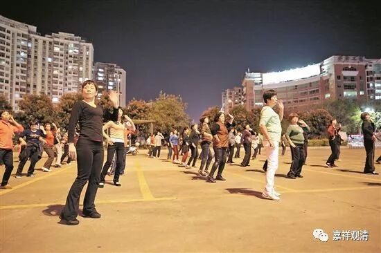

##  《菩提速道》讲记125（上） 

大家看过《能海上师传记》没有？里面说，能海上师在拉萨 “嚼盐吞饭”。你们比他要进化一点，你们不是“嚼盐吞饭”，而是海苔包饭，还要用波力海苔包着饭吃。 这和能海上师 “嚼盐吞饭”不是一个档次啊！你们福报大概比较好些……哈哈哈哈！ 

能海上师在五台山的那个时候，吃的饭都不消化，然后呢，就多吃点醋 ——反正山西醋多。一顿饭——面食加醋，就结束了。等到外面有人来的时候，就说：“啊，有人来了，要上点好菜。来，谁谁，早上跟我一起吃早饭吧。”到了早上，端出来一块腐乳就算菜了，就是两个人的一顿早饭。 

**“然后，在舒适的垫上令身端直，金刚跏趺而坐，双手作等持印，令气息舒缓等。先要具备这些修定的因资粮。”**

前面的这些条件都应该尽量地具备，然后找一个比较好的地方。现在在城市里要找这样的地方真的很难，很不容易的。而且我忽然发现了我以前没有注意的一点，有一类人和我的修行是天敌，就是那些跳广场舞的大妈们。我在那边打坐，然后她们就跑来 附近广场上 唱红色歌曲， “嘭嚓、嘭嚓”的声音特别响，受不了。你去跟她们交涉的话，人家根本不理你。 

后来我只好用餐巾纸团成一团，把耳朵塞起来。稍微有点用，因为这样子你听自己的声音会更响一点，而外面的声音会显得轻一点点。你听到自己念经的声音或者念咒的声音都会响一点。本来我一直认为晚上念经、念咒计数会比较多一点，但是只要稍微有一点打扰，速度就会放慢的，所以晚上反而会念得少 …… 还是在山里好啊！ 

但是， 轮回里面 也没有完全好的地方。在山里的时候，如果没装纱窗的话，把灯一打开，哇！一个晚上可以飞进来 200只飞蛾。而且现在我们基本上都用电脑的，山里 面下雨的时候得 少用电脑。 有一次， 我在 用 电脑上 文件 念经的时候， 耳边一个炸雷 ， “夸叉”！ 手就从鼠标上 “啪”地震开了。我吓死了——电脑不会坏了吧？ 还好，电脑没事儿 …… 我们好像的确是会先关心电脑的吧？就好像地震以后，自己的命先没关注，却先关注房子倒没倒 —— 财产才是我们最当回事儿的。 

