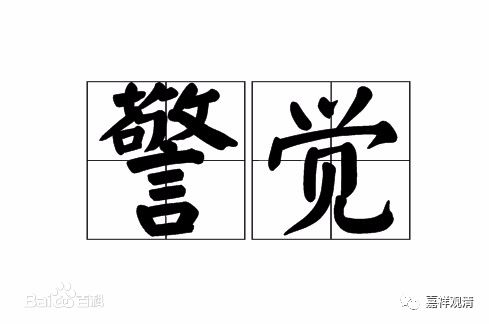

##  《菩提速道》126（中） 

**“心中还应发起强烈的誓愿：愿在此一座中，根本不生沉掉，如若生起，立当断除！”**

就是在 这一座当中 ， 让 它 更加圆满一点。 

我们现在看来，越看就越觉得这像是自我催眠 ——“ 我 这一座 不生沉掉，如果沉掉，马上就断除 ” 。这也就是给自己一个提醒 。 我们平时睡觉也是一样，你给自己一个提醒 ： “ 明天早上五点钟起来 。 ”那么到 五点钟的时候就差不多会醒过来，前后不会差个五分钟，基本上就起来了。 

再比如你中午打瞌睡的时候，给自己一个提醒 ： “ 如果 快递来 敲门的话，就马上起来 。 ” 但是 ， 如果你不加这个意识的话，你就会一直睡过去，睡 两 个小时都没问题 。 甚至在有人敲门的时候 ， 你又做了个梦，梦里面有人在敲门 。 而你有这个 提醒的话， 一旦有人敲门，甚至楼下有人在剁 肉馅儿 ，你 就 马上 会 醒过来了。 

就是要有这样一个念头 。 打坐的时候如果有这样的念头 ， 碰到昏沉或者掉举的情况，基于前面的这个念头，就比较容易 马上 反应过来 、马上警醒 。虽然在定义上它不属于 “ 作 意 ” ，但我觉得这个是有点接近 “ 作 意 ” 的 意思 。作 意的 定义是要在这一刻同时生起的，不是前面和后面的次序差别。但这种念头就有点像作 意 ，这种警觉性是你预先已经放到 “ 程序 ” 里面去 的 ，然后这个程序还在微弱 地 执行着，等到外面稍微有一点点声音 —— 一敲门 ， 马上就醒过来了：快递到了。然后一看 ：咦 ， 没人。噢 ，是楼下在剁饺子馅儿 …… 所以是在这里面预先加一个程序。 

**“愿在此一座中，根本不生沉掉，如若生起，立当断除！”**

马上断除，马上反应过来。在你心力不够的时候是醒不过来的 ： “ 哦，来快递了 。 ” 然后又在梦里面把门开了，把东西 也 收了。过一会醒来的时候就糊涂了： “ 我到底收没收快递啊？ ” 是吧？ 

**“然后一心专注所缘，不令从心境中忘失，时时忆念所缘，守护彼心的续流，是初业行人修习住心的殊胜方便。若心无法摄持蚕豆粒般大小的佛身，那么可以观为一寸长，若于彼仍不能摄心，可观为五指宽大小。”**

以 我自己的经验，我觉得对我们来说大一点没关系的，就大一点吧，小的可能做不到。这里面的意思还是 和 修密法有关 ， 因为修圆满次第的时候 ，会要求很小很小的，所以平时修习的时候就尽量小，什么一块钱大小啊、蚕豆粒大小啊、豌豆般大小啊等等，到最后要像芥子一般大小。所以这是和修密法有关的。就我们来说，可以大一点，至少我自己观想的都会比较大一点。 像硬币 那么小的话， 初学 可能 还是 观想不起来，太难想了 …… 那 可以 宽泛一点，轻松一点。 

