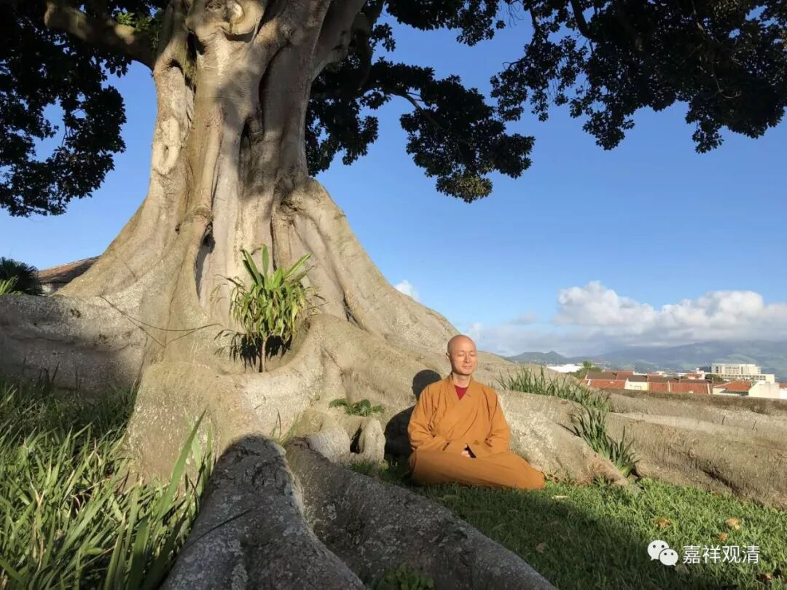

##  《菩提速道》126（下） 

**“若暂时只能现起一头、二手、二足、身腹等半分总义，也应知足于此摄心安住。”**

就是你只要有个对境就可以了，然后这个对境的背后有内部的含义就行了。 

**“于此能摄心后，有时可从顶髻向下依次观令明了，有时可从莲月座向上依次观令明了。”**

就是有时候你可以从上到下想一想，也可以从下到上想一想，都可以，并不是只有一种方法。 

上次我也说 过 ，王朔就 曾经讲 他描写一个人的时候通常都是从脚底写起的 —— 穿着什么鞋，然后再一路描写上去 。哎，这和《 六臂玛哈嘎拉 护法 祈请文 》 是一样的哦 ， 从脚踩着什么东西开始 …… 然后 到顶上。评书也是一样 ： 某个人跨虎头 战 靴，腰缠什么什么 ……最后头戴什么什么。这 里从 上面往下观，或者从下面往上观，都可以。 

**“心应松紧适度，”**

太宽 泛 也不行 ， 是吧 ？ 太紧 张 了 ，就要 把它调整一下 。一般 一开始总是 是 做不到 松紧有度 ，就像我们打拳的时候 ，肩膀总是放不下来， 特别是打内家拳的时候，肩膀总是 在那里扛着，太紧张了，要放松 。可能是因为我在边上， 所以比较紧张 ？如果你 女朋友 在边上的话，那就更紧张了。 一定要放松。 

**“一心安住于所缘境决定明了的状态中，这极为重要。”**

这 里说的 “ 所缘境决定明了 ” ，并不和前面的相违背 。 前面说能够想起来一个大概样子就可以了，这里的 “ 决定明了 ” 就是指大概样子 ， 你知道就可以了。要完全 观想到 眉毛有多少根，做不到的，至少对我们 目前来说，做不到。这个是到最后的阶段要求做到的，到 观想的最高阶段 是要求做到的。什么一一毛孔有八万四千的佛，对吧？一些主要的关节是八大菩萨，五蕴和四大各是什么菩萨什么佛等等，这些都要观想起来的。现在我们先泛泛地大致地想想，就可以了。 

**“否则，如过去有的先贤误解了萨热哈大师所说‘心性被系缚，能缓定解脱’的意思，”**

这 位 萨热 哈大师 ， 藏地 据说是龙树菩萨的师父 。 

**“心太过松缓，以致进入细沉而不自知；又有些后学人因宗喀巴大师说‘生起有力正念及执持力’而太过紧张，以致无法得到住分。”**

所以在这些 内容 当中，中道都是最难的，要恰到好处。恰到好处的因，首先是学 得 正确，第二是熟能生巧，到最后是任运的 。 

发面 团 也是一样，一开始怎么发都发不好，到最后就很轻松，眼睛看 一 看就知道了 。 刚开始学的时候 ， 还要去称，糖放多少，盐放多少，到后来就任运成就了，各种配料 “ 哗哗哗 ” 往那一放 ，就正好 。 

一开始烤面包的时候，多半分钟就焦了，少半分钟又感觉不对，或者蛋打多了，或者蛋打少了 。到 最后熟能生巧的时候 ， 一看就知道应该放多少， 还 骂别人笨： “ 这 都不知道 ？ ” 这不就是卖油翁吗？ “ 此 亦无他 , 但 手熟尔。 ”

