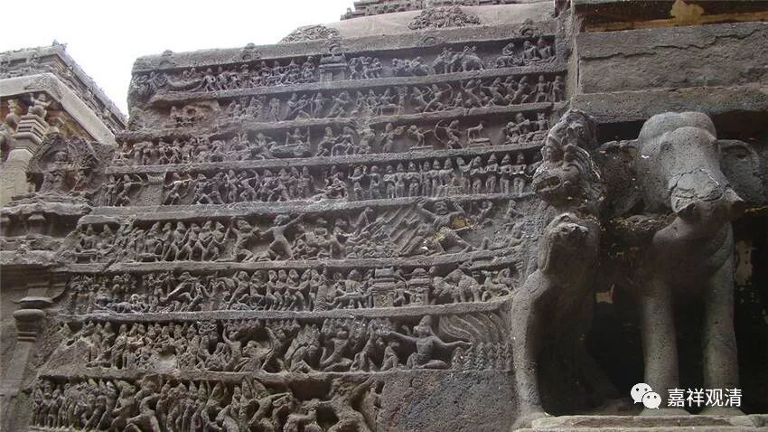

##  《菩提速道》讲记127（上） 

**“如阿阇黎大德月说：”**

“大德月”，就是月官论师，他不是比丘，是个居士，和月称论师同时代，是著名的梵文专家、唯识大师，西藏的传说，说他后期 属于中观自续顺瑜伽行派的观点 ——这就是一说吧。如果按这种说法，欧阳竟无先生、王恩洋先生都要算是中观自续顺瑜伽行派的人物了。 

大乘佛教的历史上，月官论师和月称大师有过一次著名的辩论，两位大师各取唯识和中观的观点，据说此次辩论长达七年，最后谁胜利了呢？中观师说最后月官改宗中观了，比如他后期的著作某某论中的某某观点属于中观 blablabla……还引出了歪脖文殊和无饰多罗的传说……唯识宗则传说最后月官胜利了，传出了颂子“嗟嗟龙树宗，有药亦有毒；弥勒无著书，群生之甘露！”……总之，各说各的。 

到底哪个对？要看你的师父是哪一派的  （哈哈），要和师父保持一致！如果你中观和唯识的师父同时问你月官和月称辩论的结果——那大概是你往世的恶业现前啦  （哈哈哈哈哈）！ 

我有一次 “恶业”现前  。唐老问我：“月官和月称辩论最后怎么说的？”我就把那个“嗟嗟龙树宗”背了一遍，然后继续掰扯“……还有一种说法，说是……”唐老马上打断我，“没有第二种说法，就一种说法！嗟嗟龙树宗……”我又坚持了一下“我还看到一种……”，被唐老用同样的话堵回去了。还好这时候我突然“善根迸发”  ，没继续顶下去……所以你们现在能看到活着的观清师  ，活着真好！我也祝大家长寿！  哈哈哈哈！ 

下面这段话就 是月官论师讲的 ——

**“‘若精勤修生掉举，若舍精勤复退没，**

**此平等转极难得，我心扰乱云何修?’”**

修禅定的时候，刻意努力的时候容易过分兴奋， “无为而治”般的不过多干涉呢，又容易退没，恰到好处地平等持修真是非常非常的难得，想到这里，我真是心意扰乱地想，（真想当面能问问佛菩萨们：）“到底怎么修才合适啊？！”

哎呀， 太难把握这个度了， 不沉没、不掉举，平等安置自己的心 —— 这怎么修啊？太 难 了。 

要说 “中道”真的是很难，《阿含》 讲的苦乐中道，很难；中观讲的缘起性空的中道，很难；这里，禅修的不偏不倚的中道，也很难 ……乃至世间种种的恰到好处，都是最难的。 

