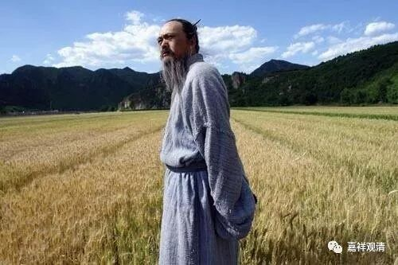
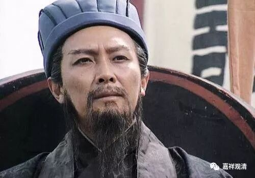
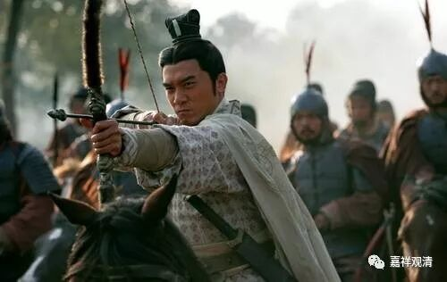
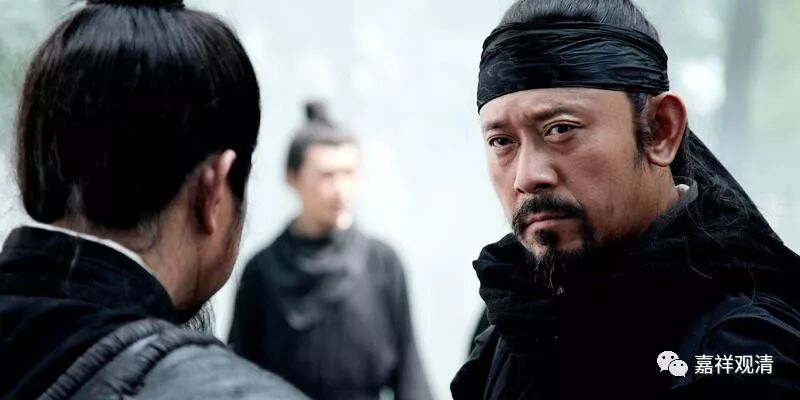

##  《菩提速道》128（中） 

**“（三）等引住于三摩地时，沉掉二者是过失。其对治法是正知。”**

正知了以后 ， 就可以对治了 ， 对治沉没和掉举。 

**“以正知善加观察有无沉掉生起。”**

正知，就像一个坚固的官员，一直观察着整个禅修过程，看看有没有 沉 没 和掉举 生起 。 

**“智慧上者，是在沉掉将生起时，即能了知并断除，”**

这个是经验比较丰富的人 ，快生起的时候就知道了，有烟起的时候就扑灭 。 

**“中者生已无间，”**

中者是刚刚生起 ， 就可以断除 ，火苗刚起来就扑灭 。 

**“最下也应不令沉掉经于久时，察觉后立即断除。”**

最下也应该在沉掉生起不久就断除，就像火起不久后扑灭火势。 等到熊熊火势起来，就很难了 ……

以上三者， 一个是沉掉还没有生起 ， 一个是生了以后 马上 就知道了 ， 一个是生起 略久 才知道 。 

我记得我以前做 过 一个比方的 。这里 “ 智慧上者 ” 就是诸葛亮 ——未卜先知，就是沉掉还没有生起来的时候，他就已经知道了。 

“中者生已无间”，生了以后马上就知道了，这个是周瑜——一见就知 。他出去视察军营，突然之间，旗角飘到了脸上。 “啊！”吐血。“万事俱备，只欠东风”，怎么办？周瑜 的智慧，比喻 是生已无间，方能 得知 。 

曹操是 过后方知，比喻 沉掉久时方知的那种 。曹操 经常这样： “嗯？你的想法和我的一样。”过了一会儿：“你再说说看，是什么想法啊？”他对杨修说：“对，你让我再想一想。”这再一想，就跑出五里路去了，然后：“我猜出来了，不过我还是要考考你。你告诉我，答案是什么？” （ 实际上我认为他大概是不知道的。 ）曹操过后方知。 

所以上面三种，可以拿诸葛亮、周瑜 和曹操来比方 ——未卜先知、一见就知、过后方知。 这三种，也需要智慧，也需要经验。 我们修禅定的过程，也是这样慢慢的，要从一般人过渡到曹操，进而周瑜，然后到诸葛亮，混混沌沌-过后方知-一见就知-未卜先知-从心所欲 ……

最后就是从心所欲，孔子老年的时候了……

