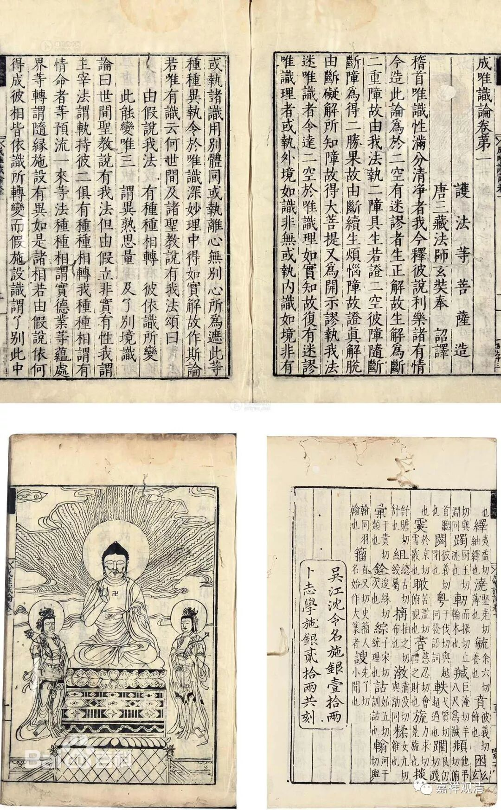

##  《菩提速道》128（下） 

**“若问：‘昏昧与沉掉二者的差别是如何的呢？’”**

这个呢 ， 至少在汉传的唯识 当中 没有这 样 的分法 。 那么 ， 藏传的唯识或者藏传 格鲁 在这方面的讨论呢 ，比较注重定义，所以就觉得定义上不一样。 

**“所缘境不明了、身心沉重是为昏相。若是昏昧，一定属于痴之一分，犹如黑暗降临心中。心虽不从所缘向它逸散，然无澄净分和明了分，念力衰弱，是为粗沉之相。虽具澄净分和光明，然于所缘决定的有力定解稍有退失，是为细沉。它们的对治法是忆念三宝的功德，或作意明相以及修习风心与虚空相合的教授。”**

昏昧是什么呢 ？ 是对所缘境不清楚 ， 身心全部都沉重的 ，就像 睡觉一样 。如果是 昏昧 ，一定 是属于痴的一分 ，属于无知的一分。 那么 ， 沉掉两个呢 ，则 不一定 ， 或者说不是痴的一分 。 （ 哎，这里 没有掉 ？它这 是 和 沉掉的差别呢 ， 还是和沉没的差别 ？应该是和沉没的差别吧 —— 沉掉是两个，这里只讲了一个。这是和沉没的差别。 ） 

沉没当中又分两个，粗的沉和细的沉。粗的沉，澄净分和明了分都没有；细的沉，是澄净分和明了分都有，但是力量不够。这个大家打坐时间长了，到时候自然会知道，有了经验以后就可以了解这两个的差别。 

第一个 粗的沉没 呢，是澄净分和明了分都没有，对方好像也找不到了，对方也不清楚了。第二个 细的沉没 呢，也在那里，也清楚，但是力量不够。这里的粗沉是 “无澄净分和明了分”，细沉是“具澄净分和光明”，好像确实和其他地方的说法有点不一样。意思就是虽然有明了分，但是不是很明了。“定解稍有退失”，从这个角度来讲，明了分有，但不是很明了。大家领会精神吧，意思就是：不是很清楚，在好像还是在的，但是力量有点不太够。 

做爸爸妈妈的人一般会比较了解这个，粗的和细的。 “听见了吗？听见了吗？”一般小孩子都是说听见了。家长一看孩子那个样，耳朵一拧，就可以分清楚他是真正听清楚，还是没有真的听到你的话。 

格鲁系统的法相多分随顺 《集论》 和《俱舍》，《集论》说： “ 何等惛沈 ？ 谓愚痴分 ， 心无堪任为体 ， 障毘鉢舍那为业。 ” 汉传唯识多从 《成唯识论》 ，《成唯识论》说 “云何惛沈？令心于境无堪任为性，能障轻安 、 毗钵舍那为业。 ” 这里说昏沉有自体性，非痴之一分，和《集论》意思有点不一样。 

