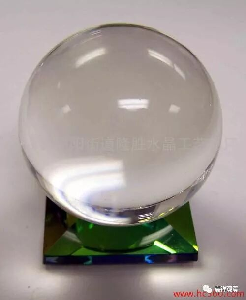

##  《菩提速道》讲记129（上） 

**“它们的对治法是忆念三宝的功德，或作意明相以及修习风心与虚空相合的教授。”**

就是 用各种办法 让自己 在修订的时候 更加 清醒一点 。 “ 忆念三宝的功德 ”， 就是知道三宝的功德很厉害，让自己兴奋起来 。 这必须是对三宝种种功德有所了解的，否则内容没有，想都想不出来，也不会兴奋。 

“作意明相”呢，也是让自己兴奋一点，想自己面前是一片光明。 《瑜伽师地论》里谈到过。 “光明想”其实有两种。还有一种是思维法义——“法光明”。“光明想”的方法，可以拿来修神通，类似于江湖上有名的圆光术……观水晶球就是一种 圆光术，藏地的观湖也可以说是广义圆光术的一种。 

“修习风心与虚空相合的教授”呢， 下面又将。 我不知道这个是因为什么 （能令心兴奋） 。 （ 我自己修了一下， 我怀疑 主要的原因是不是怕自己死掉 ， 所以自己就会精神起来 ？ 它的修法好像是 把你自己的身心融入到虚空当中去。我觉得这样弄两下，自己会不会死掉？ ——从自己的身体里出去了…… 然后就立即清醒过来了：“不修了，不修了 ，吓死了 。” ） 

**“风心与虚空相合的教授：观自己的脐部有鸟蛋般大小的红白明点，”**

多大呢？鸟蛋 ！ 是哪个鸟的蛋？鸵鸟蛋？鸽子蛋？麻雀蛋？ 估计不会太大。 

**“从自己顶上冲出与空灵的虚空相合无二无别，于此专心平等安住。据说此与启虚空门的界识和合相似。”**

这个就不知道了，反正也没有学过什么 “启虚空门的界识和合”。 这里 是想用后面的这个来让大家理解前面的 ， 是吧？但是后面的这个我更不知道，前面的 多少 他还说了一点 ， 是吧？鸟蛋大。 

**“内心不能无动安住于所缘稍微向外流散，名为微细掉举。其对治法，当依正知正念而修。”**

微细的流散焦微细掉举 …… 都是依 靠 正知正念 来 修的。 这里微细掉举的说法不常见。意思上可以有，比如欲界的烦恼可以分为上中下品乃至九品，那这里把掉举分两类也不是不可以。 

