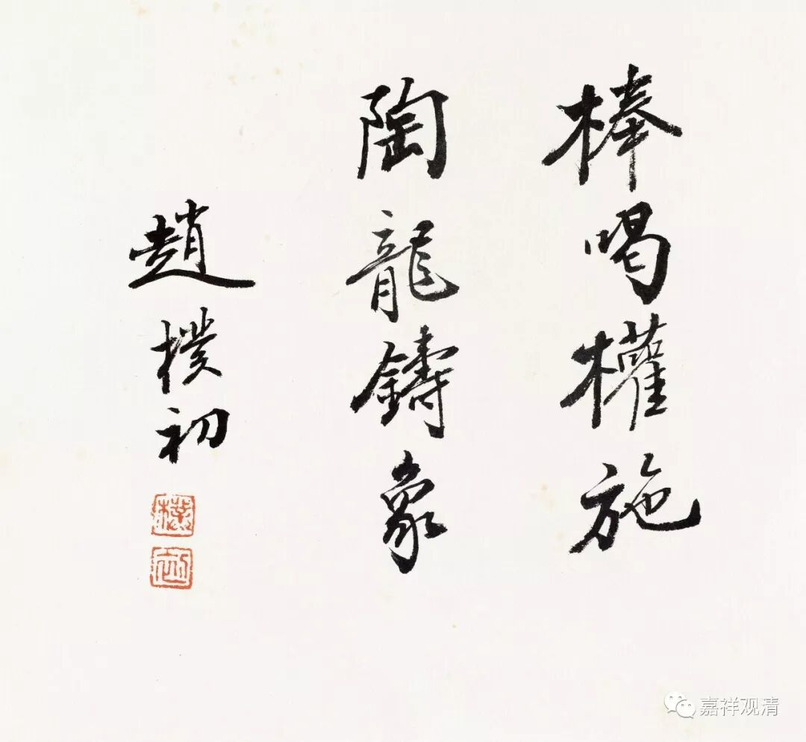

##  《菩提速道》132（中） 

**“若念：‘前后世的我及此世的我三者是毫无关联的异类。’”**

前世的我 、 后世的我及此世的我，三者都是毫无关联的异类，那一样地 ， 前面的问题又出现了 。 

**“若是那样，就有未作业受果、已作业失坏等许多的过失。”**

这个过失很多 。 “**未作业受果**”——你今天的果没有因；“**已作业失坏**”——已经造的因没有果…… 可 是 ， 我们大部分人 却 这样理解 ： 前一世的我和这一世的我 ， 这一世的我和下一世的我，都是没关联的 。 这一世我做了再多的坏事，下一世受报的好像是另外一个人，跟我没关系的。但实际上受报的人还是你啊 ！ 

比如我们小时候读书的时候 ， 今天的我做了一件错事 ——考试得了一个不及格，最多拖到明天早上去上学之前：“妈妈，这个要签字。”只是拖了一个晚上，对吧？到时候被骂，还是避免不了的，说不定回家还得再补一次，是吧？这个逃不了的。 （所以知道昨天的我和今天的我 有关系啊！因为辣辣的屁股就给我现实的答案了。 ） 

不知道学霸们怎么做的，像我这种偶尔的学渣也会有不及格的时候。这位学霸，你有不及格的时候吗？ 什么？ 居然维妙维肖地模仿老妈签名？你胆子真大！也不怕被你妈抓到。哎呀，学渣的思路和学霸的思路就是不一样啊！也可以看出我们 70后还是比较老实的哦。 

**“故尔那样所执之我与五蕴为一不能成立。如是思惟。”**

就这样思维。这样 的 思维是可以有无量门的，这里只是取其中的部分，实际上可以有很多很多的方法。 

**“另外，若那样所执之我与五蕴为一，那么由于是谛实成就之一，则应一切部分都应完全为一，如是则应我不是五蕴的受取者，而五蕴也不是我的所取。”**

比如说 这个 五蕴，那这样就不能说是我的五蕴了 ，否则 能取和所取就是 “ 一 ” 了 。 而能取和所取 为 “ 一 ”， 是不能够成立的 。 比如我造瓶子，我不能就是瓶子呀 ……类似种种问难 在《中观论》当中也有说。 

**“有如是等多种过失。”**

有很多的过失 。大家可以自己学习一下《中论》、《入中论》 。 其实唯识也有很多种方法的，和这 里 不完全一样，也挺好的。 

