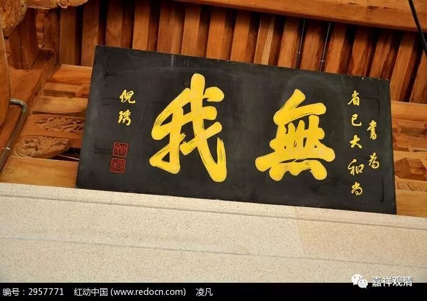

##  《菩提速道》133（下） 

**“如是依于四要点的观察，如果决定了没有如俱生我执所执之我，就当远离沉掉，一心专注，将护彼定解的续流。 ”**

那么 ， 俱生我执 所执着的 “ 我 ” 被找到了 ， 它 和五蕴之间 就只有一和异两 种 情况 。如果一也不是，异也不是，那你就要去怀疑人生了，你要去怀疑你的第一个判断 ——俱生我执的存在。最后，你只能得出结论说，俱生我执的对象是不存在的。 

**“若定解力略有衰退，则初业行人当依前面所说，以四要点观察，引生无谛实的定解；慧力高者，可以观察是否如俱生我执前如何显现的我那样成立，与四要点观察相似，由此引生无谛实的定解。在这样观察的最后，初业行者应会生起一种恐惧的感觉：‘我在五蕴上，就连一点真实意义的存在也没有，我整个没有了！’”**

最初学习无我的法的人会有一种恐惧的感觉 …… 大家可以看一看啊 ，你们有没有这种情况。 

**“如果生起这样极大的恐惧，说为最初获得了中观正见。”**

这里说，引号 “我”整个都没有了，就是我执着的那个“我”整个都没有了，于是生起了极大的恐惧。因为我们以前一直很习惯这个“我”的存在，突然之间自己紧紧抓住的那个东西没有了，就生起极大的恐惧心。 

比如对和珅而言，乾隆死的那一刻，他就生起了极大的恐惧心，对吧？好像刀子快要落下来了，因为他依靠的对象没有了。我们在整个轮回当中依靠的对象就是这个我执，这个我执的原因是一直抓着那个 “我”，而现在这个东西没有了，那就生起了极大的恐惧心， 这是 最初获得了中观正见 时的一种情况 。 

**“这时在决定的心目中，决定无有自性的定解鲜明有力；而在显现的心目中，破除所破谛实后的豁然空朗。具备这两种特点，于此专一将护修习，即是根本定如虚空的保任方法。”**

在根本定 中 观察 到“ 自性 是 根本不存在的 ” ，是 很清楚 地 表现出来的 。 然后呢 ，你要找的那个东西 不存在 ，就 有 那种 “豁然开朗”—— 感觉 到 空 的 感觉 。 保持这种状态的修习，就是所说的“根本如虚空”的做法。 

