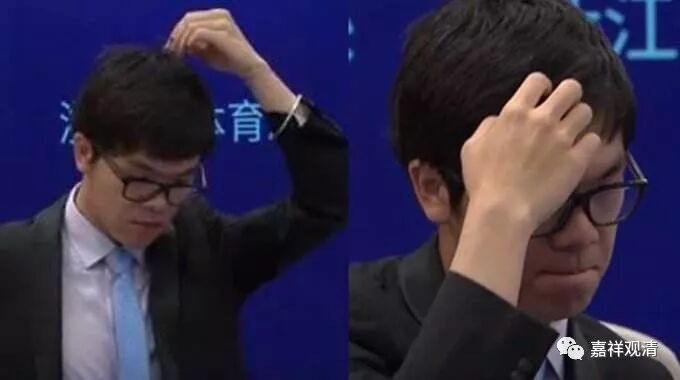
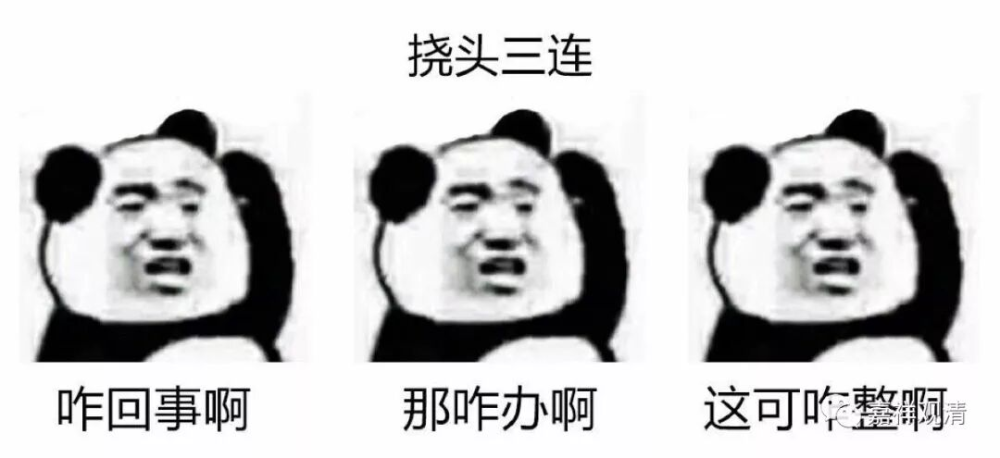

##  《菩提速道》讲记135（上） 

其实我觉得还是存在这个问题：最终他要抉择的是 “今天的心，不是独立实有的”，但并不是“心，不是独立实有的”。实际上我们在学习阿毗达磨的时候应该知道，假如其他宗派把这个心认为是独立实有的话，他们在讲这个心独立实有的时候，是以刹那的心作为独立实有的存在方式。这个大家能听懂吗？所以其他宗派执着的那种方式和这里要破除的方式好像是不一样的。 

好像用心和境之间的关系来破除执着更加简单，但我不知道为什么不用这个方式来破除。要不你们去烧支香问问吧，我也不知道他为什么要这样破。前面色法的破除我能够肯定他，但是后面的破除法我都觉得有点奇怪，包括那个对 “年”的破除也是一样奇怪，他所有的方法全都和色法的破除没差别。包括后面对无为法的破法，我也不能接受。 

所以说实话，我不敢说 自己 对这里的内容一点都不怀疑的。当然，我的质疑并不是说 “他不是佛，他在这方面的说法错误，他还没有证悟……”等等，不是这个意思。但是我觉得他在这里讲的方式或者方法 我 是不太 理解 的，至少他所提供的这种思路 好像 …… 这几种思路都是和色法的破除方法完全一样的。 

难道这里认为阿毗达摩说的 “心”是 遍计？是分别执？不至于这么决绝吧？ 

**“若是一，则今日上午之心上应有下午之心；若是异，那么除去今日上午下午心二者外，还应有一个今日之心可以找出来说‘这就是今日之心’，然而却指不出来。因此，其所执之心是根本不存在的。如是思惟，如前引生定解而修习。”**

那么 ， 他 似乎 也只能破 “今日之心”的实有， 似乎 并没有破 “心”的实有 ， 特别是佛教内部 阿毗达磨 性质的 “心”的实有并没有破除。 

虽然他破除了今日之心，同理可证昨日之心也没有，明日之心也没有， 但是 仍然不能说心没有。如果要这么说的话，那破除的仅仅是 “ 你的假名心 ”，你认为的心 。如果 要让我和五世班禅大师来辩论这个事情的话，我会说： “ 你破除的是 你的 假名的心，而我的心的概念 并非如此 。 ” 比如有部 心的概念是最终的、一刹那的有法的那个心 ， 你 和 我谈的根本就不是一个心啊 ， 你只是破掉了你自己认为的那个心啊。 

