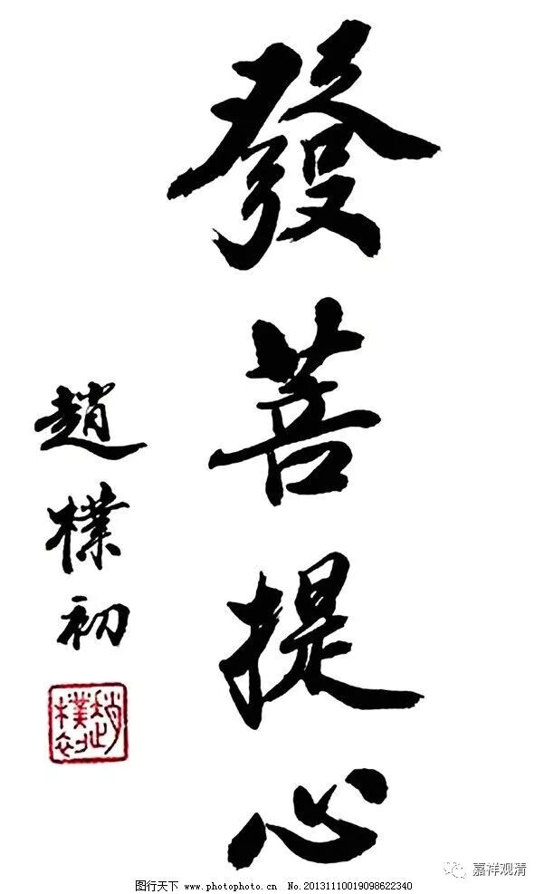

##  《菩提速道》137（三） 

**“所作一切都是为了利益有情的心念，若显得不强烈，则会断送大乘之根本，当净修愿菩提心及其因；”**

求解脱的心有两个趋向 ——声闻乘与菩萨道（现在我们尽量用平缓一点的词， 当然本身 “大小乘”的说法也并没有错，龙树大师、无著菩萨们的论典都是这么用词的。有些大乘内部的人刻意地说“大小乘的用词不对，不应该这么用”，那么，两位大乘标志性的论师错了吗？ ）作为大乘的行者，当以 菩提心为核心，若失去菩提心的伴随，解脱也将流入自利的范围，而离开大乘的进路。我们都自称大乘人，但在多大程度上是大乘就不知道了。 

这里说 “大乘的根本”，就是菩提心了。如果以教法理论来说，大乘不共的理论则是“承认法无我”（按通常的说法，一般说声闻教法仅述及“人无我”），关于法无我、人无我的讨论，我们可以在进一步学习宗派论或者佛教思想史的时候再谈。 

大乘的 “菩提心”，就是“为了利益一切众生，愿成就佛果（来实现这个目的）”——这里，“利益众生”是目的，“成佛”是手段。 

之前说过，有些法师说 “为什么要利益众生呢？因为不利益众生就不能成佛，所以我们要度众生……”这种说法就是以“成佛”为目的，“利益众生”为手段——这种发心并不是正确的大乘发心，我们要注意鉴别。那接下来“为什么要利益众生呢？”答案是——因为众生苦！那么，如果你还聃着轮回的安乐，不以为苦，你又怎么能体会众生苦、怎么会发起“帮助他们解决苦”的心呢？所以这一段是接着上面“生起求解脱的心”下来的。 

在声闻经典里也有出现 “菩提心”的说法，那并不是这里的“大乘菩提心”，而是单纯地指求解脱的心，就像“三十七菩提分”里“菩提”的用法一样。我们这里谈的“菩提心”，是指大乘的“菩提心”，也就是《金刚经》里的“阿耨多罗三藐三菩提心”——无上正等正觉心。 

菩提心有两种，愿菩提心和行菩提心。愿菩提心的生起，目前传承下来的有两种方式（若加二种合修则有三种） ——“菩提心七因果教授”和“菩提心自他相换教授”。一切有为法都有因，那么菩提心的因是什么呢？我们通常直接说是“大悲心”。 

