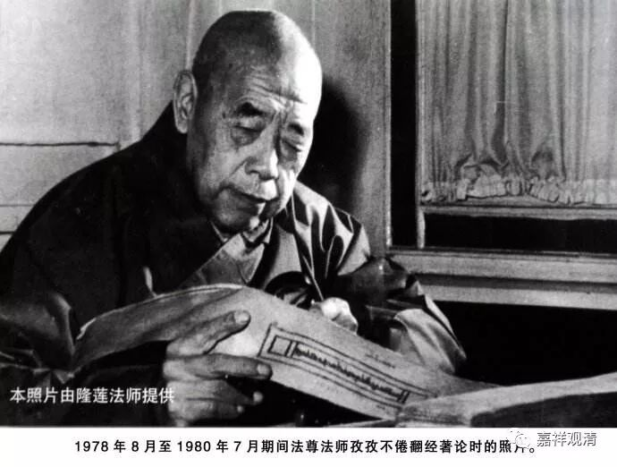

##  《善说精髓》讲记002（中） 

当时这些学佛救国的知识分子们，在接触藏传佛教的时候，一眼就看到了格鲁系统当中关于道次第的殊胜之处。那么，法尊法师在后期又把其他特别重要的内容 比如《现观庄严论》、《入中论疏》、《集量论》、《释量论》、《七十空性论》 都翻译过来了。 

以我们今天来看，如果要说 “翻译车轨”的话，他基本上算是一大车轨了。最重要的核心的内容——比如宗义方面的论著， 中观方面， 《入中论善显密意疏》、《入中论颂》、《入中论释》 …… 这些他全部都翻译过来了。我们应该非常地感激他。很可惜的是，他的一生中间大概有二十到三十年没能够专门地去做事，这个也是众生的福报比较差吧。 

我以前看到这种事情会觉得 “ 这个是法师的福报比较差 ” ，因为他没有时间去翻译了嘛。后来格西 拉 跟我讲了他的观点，我觉得很有道理。那个时候我们在聊密悟格西的事情，密悟格西在拉萨的传昭法会上考头等格西的时候是第七名，非常了不起，但是他翻译的东西基本上没有留下来的。我就说： “哎呀，看样子密悟格西没有福报啊。”然后格西 拉 就对我说： “不是密悟格西没有福报，是当时的众生没有福报，是这些众生根本没有福报能够看到由头等格西翻译的好东西。”由此可见，格西们的思路和我们是完全不一样的， 但确实是有道理 …… 所以我们要慢慢学习这样的一些思路。 

##  密悟格西 

还有，我们学习因明或者学习一些思维方法，其实也是一样的，要不断地对自己的想法进行质疑：反过来行不行？记得我在跟格西 拉 学习的时候， 他说，以前 他在看书，两个小时以后要做事 的话 ，他就会告诉他的弟子： “过两个小时的时候你提醒我一下，我要做事了。”因为他自己看书的话，四行字他可以看两个小时，如果没有人提醒的话，会更长时间地看下去。就那四行字，他会不断不断地和自己辩论，看看多一个字或者少一个字行不行。 

刚才密悟格西的事情也是一样，我们的第一反应 ——脑子里面首先冒出来的，就是 “ 密悟格西的福报比较差 ” 。这是一个很现行的思维，是吧？第一反应就觉得是他的福报比较差。而格西他们却会反过来重新想： “一定是他的福报比较差吗？会不会有背后的原因呢？”再去找原因的话，就可能会找到更深层的一些东西。我们平时如果能够养成这种思维习惯的话，也会比较好。 

