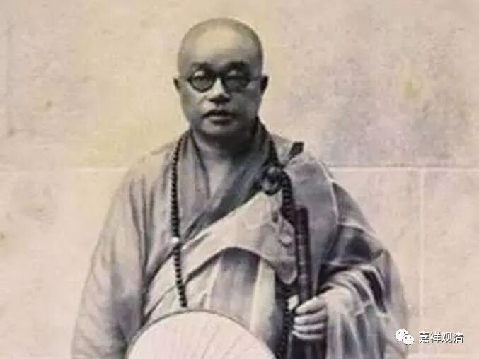
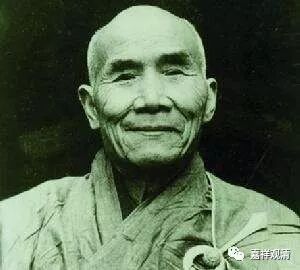
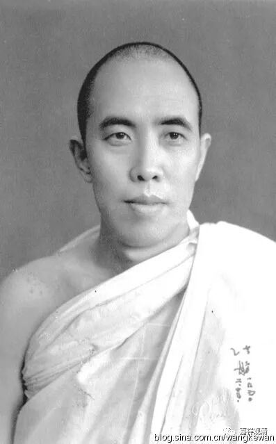

##  《善说精髓》讲记003（上） 

法尊法师是 带着 太虚法师的 期望 去学习的， 太虚法师希望中国佛教能八宗并弘，希望诸多弟子能各宏一宗，这样百花齐放、万紫千红，中国佛教就能够兴盛 ……手下收罗各类人才，像印顺法师、法尊法师、观空法师、法舫法师、持松法师、慈舟法师……这些都是他收拢来的僧才。太虚法师自己门下直接剃度的则有大勇法师、大醒法师、大刚法师这些（还有个大愚，走偏了，《太虚法师年谱》里直接点名了）。 

##  观空法师 

##  法舫法师 

后来太虚法师写了一封信 给法尊法师，让他回来办学， 他就赶回来了，帮着太虚法师 操持佛学院。当时，佛学院这种形式还很新鲜，丛林里老派的上座们都乐见其败 ——当时佛学院的院刊《海潮音》免费赠送给诸大寺院，竟然有不少被退回来了！！！ 太虚法师自己在文章里说，他认为自己的佛教改革算是失败了，很伤心，但是法尊法师后来补了一笔，说最后这种办学是成功的 。 现在我们看来似乎当年太虚法师很红火，但实际当年是非常的艰难，很被传统势力压制。好在 “历史”是由精英写就的……

后来呢，还有观空法师。很可惜观空法师翻译的东西留下来的更少。我听说，其实观空法师的资料和翻译的作品大概是有几箱子的，但是他圆寂的时候被 某 国社科院收掉了，然后这些东西就莫名其妙地没有了。再后来，就出现了 某 国社科院的某些人翻译的作品，而观空法师的一些弟子就发现怎么那么像他们老师翻译的 ……就去讨要那几箱资料，人家说没有！现在 已经找不到那些内容了 ，不知道哪天还会冒出来 。 不知道姆们众生有没有福报。（ 对了，据说密悟格西也有很多翻译作品，原稿的稿本还在某寺院 …… ） 

这种情况还有的，比如 某 国社科院还有某人 ——名字我就不讲了，他翻译了某部宗派论，结果某位译师看了他的译本之后说：“感觉这怎么那么像我文革前翻译的东西呢？”因为文革的时候，很多译师的译稿都被 某某 社科院收掉了，然后 这批东西又 不见了。那么就有一些人把这些当做是自己的收藏，改几个字就变成自己的东西了。 

今天这种事情 现在 在藏 区 也出现了，拉卜楞寺有很多老版本的论著，现在都不敢印刷了， 因为有一段时间老的书 一印出来以后，有些人改了几个字，就变成自己的作品了，所以搞得拉卜楞寺现在印书都不对外发行了。 ——人要学好不容易，一旦有利益，变坏却很简单，怪不得荀况老先生要说“人性本恶”，“其善者，伪也”！ 

