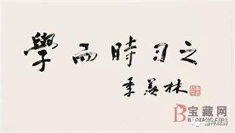

##  《善说精髓》003（下） 

昨天晚上我们也聊到了，如果你的年纪已经到六、七十岁了，那就主要学习道次第就可以了，有问题就 找老师 提 问 就可以了 ——不过你们还没到六、七十岁的就别说这个话了。我们没学多少的话，还是要设法去多学一点，因为你再怎么样，哪怕你就是到净土去学习，所学的内容还是一样的，不可能到了净土之后就突然之间不一样了。我们很多人都想赚个便宜，觉得到了净土以后突然之间你就会从傻瓜变成大菩萨——这个绝对不可能啊！这是两回事。你到李嘉诚家里去扫地，别以为你就是李嘉诚啊！ 

菩提道次第的教法传过来也有近百年了，如果是从三十年代开始算的话，现在大概有八十年左右吧。龙相 师 有一篇关于环境的论文，我觉得很奇怪哦，为什么可以用和环境有关的论文来写道次第呢？哦，原来是指传播环境啊。这个比较厉害，大家有兴趣的话可以去看看，是关于菩提道次第相关的汉译教典在汉地的流行，她的师门就是专门搞文献研究的，是不错的。 

这部《善说精髓》的整个篇幅并不长，不像《广论》那么长，《广论》本身就有二十四卷，学一遍的话真的得几年。《善说精髓》如果不广讲的话，不用很长的时间，所以我们就挑这部《善说精髓》来讲一讲。 

这部论的作者的传记呢，现在不算很清楚，前一段时间好像有一篇稍微长一点点的，但是我没有记住。现在的这个简介并不长。达 波 · 昂旺札巴 ， 时代 大概 是公元十六世纪 。这个达 波昂旺札巴呢 ， 我们再 说 一次 ，他 不是大藏寺的那个昂旺札巴 啊。 

西藏人 的 名字啊 ， 都喜欢挑好的 ，所以 相近的名字很多很多 。你千万别到寺院里去喊 札巴 ， 你 要是喊 札巴的话 ， 一个寺院可能给你 站起 一千个人来 。 你要是喊昂旺扎巴的 ，可能 站起一百个人来 。所以西藏人很喜欢给出家人起外号，就是互相之间起外号，有一个原因就是起了外号大家会比较知道是在讲谁。比如说胖的金巴，如果两个金巴都胖，坐在上面的就叫上金巴，坐在下面的就叫下金巴。或者就管地名，比如说这里的达 波就是地名嘛 ， 管地名来叫也是一种方式 ，否则 直接叫名字的话 ， 那同名的人实在太多了 。 

西藏有个习惯 ， 很多人就都会到寺院或者附近 的大师那里去受戒，那么大师呢，会把自己名字送给受戒的人。比如说大师叫昂旺札巴的，他就会把昂旺或者札巴送给几千个人，甚至几万个人，那他们就都叫昂旺了 ——昂旺如何如何，也有几千个人都叫札巴了——札巴如何如何。 

你们去看从印度回来的那些格西们或者师父们，百分之九十五以上都叫丹增，别问了，都知道。这个和汉地的习俗正好不一样，汉地是另外再给你排一个辈分，藏地是师父直接把自己名字当中的两个字送给你。夏坝仁波切传法的时候也是一样哦，有一年所有来参加法会的全都叫妙法，然后过了一年再来参加法会，还都叫妙法，再过一年又都是叫妙法 ——这个好记。比如说，有居士过来了：“师父，我是15年皈依的。”“哦，你就是妙法，是不是啊？”肯定没问题，不会记错的。居士一般也会很配合：“是啊，师父的记性好好啊！” （我觉得这些居士都比我会做人。） 

