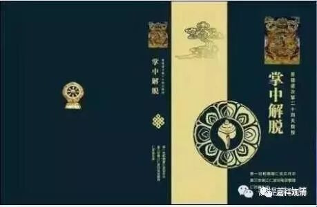

##  《善说精髓》004（中） 

**“江波译”**。 

江波这个名字大家已经很 熟悉很 崇拜了 （ 如果江波听到我在这里说他的好话，他的耳朵会红吗？ ）。 他以前 常用 的 笔名更 有 名 啊，叫**“仁钦曲札 ”，**他翻译《掌中解脱》署名就是仁钦曲扎。二十年前就有人以为这是一个老先生的笔名，后来撞到本人，则连称 “不可思议”——太 年轻了！ 

他 还有个 笔名 是什么我有点忘了，昂旺根敦吗？他的名字很多，跟茅盾一样，跟鲁迅一样。我的名字也很多啊，前两天我就暴露了我的一个蒙古名字 —— 那 仁 朝 克图 （汉文意思是太阳的光芒） ，我自己都快忘了。 

**“敬礼诸大德师长！ ”**

敬礼诸位师父。上次讲过开头的礼敬比较重要 。 

我也一直讲这个故事：我们的朋友当中有一位也曾经做过翻译，到后来视网膜都脱落了，之后有位格西就说： “这个家伙太自大了，翻译的时候都没写译前敬礼 ，所以 …… ” 这位兄弟 确实是有点狂哦，好像是个复旦的理工男，对吧？是复旦的还是交大的？嗯，是复旦的理工男。他的语言 把握 能力好像不行啊，跑到 头等 格西那里说： “你什么时候翻译 完 了之后就给我看看，我帮你改改。 ” 哇噢，这是要收徒弟吗？ 理工男汉 语言的驾控能力不行啊！差点把 能听懂这几句汉语的 格西气死。 

**“敬礼诸大德师长！”**

这是前面的礼敬，表明自己是有师承的，也表示自己谦虚，是吧？另外一方面，还表示自己要请师父们啊、佛菩萨们啊都来加持 、遣除障碍 。这个方面呢，一定要注意。 

我的水平 呢， 就是 到这里为止，归敬颂 这句话我能写得出来，后面的 （正文） 就写不出来了。我写书的话只能写这第一句礼敬的话，求佛菩萨加持，之后我还是写不下去。我以前有尝试过，写了个很好听的书名，然后把皈敬颂一写，后面的到现在都没写下去。 

还有一个很有趣、很搞笑的事情我们也 在这里 八卦一下。现在江湖上有很多汉地的法师，去藏地学习了 日窝甘丹派 相应的教法 、教典 ，然后 ，当 他们 应邀 去参加一些佛教的研讨会的时候，就和藏地的很多格西们一样，论文的第一句话就是 “敬礼至尊诸上师”。最后的结尾也是一样，这篇论文作于什么什么地方、什么什么山上、什么什么 兰若 ，由谁谁谁祈请 …… 非常有趣。你一看，论文的第一句话是 “敬礼至尊诸上师”，感觉不是论文的研讨会，而是论师们的研讨会了。 后面写的 “论文”也 更 像是 “论典”而不是“论文”，感觉是写教材或者教参。 

以前很多地方都翻译成 “上师”的，现在，江波译师 和以北塔为代表的译师们现在都更倾向于译成 “师长”，这里用的都是“师长”。国内新版的《掌中解脱》也已经改成“师长”了。 

