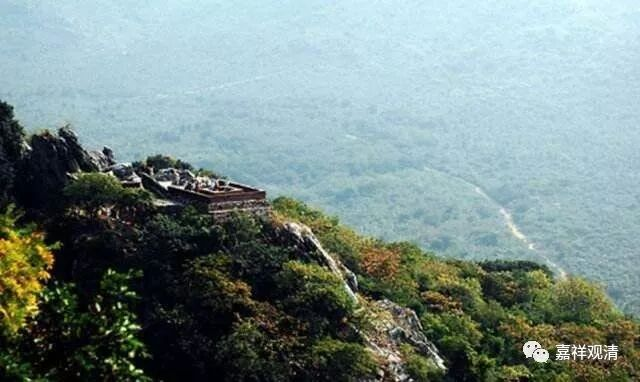

##  《中阿含·七法品·七車經》 

我聞如是： 

一時，佛遊王舍城，在竹林精舍，與大比丘眾共受夏坐，尊者滿慈子亦於生地受夏坐。是時，生地諸比丘受夏坐訖，過三月已，補治衣竟，攝衣持鉢，從生地出，向王舍城，展轉進前，至王舍城，住王舍城竹林精舍。 

是時，生地諸比丘詣世尊所，稽首作禮，却坐一面。 

世尊問曰：「諸比丘！從何所來？何處夏坐？」 

生地諸比丘白曰：「世尊！從生地來，於生地夏坐。」 

世尊問曰：「於彼生地諸比丘中，何等比丘為諸比丘所共稱譽，自少欲、知足，稱說少欲、知足；自閑居，稱說閑居；自精進，稱說精進；自正念，稱說正念；自一心，稱說一心；自智慧，稱說智慧；自漏盡，稱說漏盡；自勸發渴仰、成就歡喜，稱說勸發渴仰、成就歡喜？」 

生地諸比丘白曰：「世尊！尊者滿慈子於彼生地，為諸比丘所共稱譽，自少欲、知足，稱說少欲、知足；自閑居，稱說閑居；自精進，稱說精進；自正念，稱說正念；自一心，稱說一心；自智慧，稱說智慧；自漏盡，稱說漏盡；自勸發渴仰、成就歡喜，稱說勸發渴仰、成就歡喜。」 

是時，尊者舍梨子在眾中坐，尊者舍梨子作如是念：「世尊如事問彼生地諸比丘輩，生地諸比丘極大稱譽賢者滿慈子，自少欲、知足，稱說少欲、知足；自閑居，稱說閑居；自精進，稱說精進；自正念，稱說正念；自一心，稱說一心；自智慧，稱說智慧；自漏盡，稱說漏盡；自勸發渴仰、成就歡喜，稱說勸發渴仰，成就歡喜。」 

尊者舍梨子復作是念：「何時當得與賢者滿慈子共聚集會，問其少義，彼或能聽我之所問。」 

爾時，世尊於王舍城受夏坐訖，過三月已，補治衣竟，攝衣持鉢，從王舍城出，向舍衛國，展轉進前，至舍衛國，即住勝林給孤獨園。尊者舍梨子與生地諸比丘於王舍城共住少日，攝衣持鉢，向舍衛國，展轉進前，至舍衛國，共住勝林給孤獨園。 

是時，尊者滿慈子於生地受夏坐訖，過三月已，補治衣竟，攝衣持鉢，從生地出，向舍衛國，展轉進前，至舍衛國，亦住勝林給孤獨園。尊者滿慈子詣世尊所，稽首作禮，於如來前敷尼師檀，結加趺坐。 

時，尊者舍梨子問餘比丘：「諸賢！何者是賢者滿慈子耶？」 

諸比丘白尊者舍梨子：「唯然，尊者在如來前坐，白皙隆鼻，如鸚鵡，即其人也。」 

時，尊者舍梨子知滿慈子色貌已，則善記念。 

尊者滿慈子過夜平旦，著衣持鉢，入舍衛國而行乞食，食訖中後，還舉衣鉢，澡洗手足，以尼師檀著於肩上，至安陀林經行之處。尊者舍梨子亦過夜平旦，著衣持鉢，入舍衛國而行乞食，食訖中後，還舉衣鉢，澡洗手足，以尼師檀著於肩上，至安陀林經行之處。 

時，尊者滿慈子到安陀林，於一樹下敷尼師檀，結加趺坐。尊者舍梨子亦至安陀林，離滿慈子不遠，於一樹下敷尼師檀，結加趺坐。 

尊者舍梨子則於晡時從燕坐起，往詣尊者滿慈子所，共相問訊，却坐一面，則問尊者滿慈子曰：「賢者！從沙門瞿曇修梵行耶？」 

答曰：「如是。」 

「云何？賢者！以戒淨故，從沙門瞿曇修梵行耶？」 

答曰：「不也。」 

「以心淨故、以見淨故、以疑蓋淨故、以道非道知見淨故、以道跡知見淨故、以道跡斷智淨故，從沙門瞿曇修梵行耶？」 

答曰：「不也。」 

又復問曰：「我向問賢者從沙門瞿曇修梵行耶？則言如是。今問賢者以戒淨故從沙門瞿曇修梵行耶？便言不也。以心淨故、以見淨故、以疑蓋淨故、以道非道知見淨故、以道跡知見淨故、以道跡斷智淨故，從沙門瞿曇修梵行耶？便言不也。然以何義，從沙門瞿曇修梵行耶？」 

答曰：「賢者！以無餘涅槃故。」 

又復問曰：「云何？賢者！以戒淨故，沙門瞿曇施設無餘涅槃耶？」 

答曰：「不也。」 

「以心淨故、以見淨故、以疑蓋淨故、以道非道知見淨故、以道跡知見淨故、以道跡斷智淨故，沙門瞿曇施設無餘涅槃耶？」 

答曰：「不也。」 

又復問曰：「我向問仁，云何賢者以戒淨故，沙門瞿曇施設無餘涅槃耶？賢者言不。以心淨故、以見淨故、以疑蓋淨故、以道非道知見淨故、以道跡知見淨故、以道跡斷智淨故，沙門瞿曇施設無餘涅槃耶？賢者言不。賢者所說為是何義？云何得知？」 

答曰：「賢者！若以戒淨故，世尊沙門瞿曇施設無餘涅槃者，則以有餘稱說無餘；以心淨故、以見淨故、以疑蓋淨故、以道非道知見淨故、以道跡知見淨故、以道跡斷智淨故，世尊沙門瞿曇施設無餘涅槃者，則以有餘稱說無餘。賢者！若離此法，世尊施設無餘涅槃者，則凡夫亦當般涅槃，以凡夫亦離此法故。賢者！但以戒淨故，得心淨，以心淨故，得見淨，以見淨故，得疑蓋淨，以疑葢淨故，得道非道知見淨，以道非道知見淨故，得道跡知見淨，以道跡知見淨故，得道跡斷智淨，以道跡斷智淨故，世尊沙門瞿曇施設無餘涅槃也。 

「賢者！復聽。昔拘薩羅王波斯匿在舍衛國，於婆雞帝有事，彼作是念：『以何方便，令一日行，從舍衛國至婆雞帝耶？』復作是念：『我今寧可從舍衛國至婆雞帝，於其中間布置七車。』爾時，即從舍衛國至婆雞帝，於其中間布置七車。布七車已，從舍衛國出，至初車，乘初車，至第二車，捨初車，乘第二車，至第三車，捨第二車，乘第三車，至第四車，捨第三車，乘第四車，至第五車，捨第四車，乘第五車，至第六車，捨第五車，乘第六車，至第七車，乘第七車，於一日中至婆雞帝。 

「彼於婆雞帝辦其事已，大臣圍繞，坐王正殿，群臣白曰：『云何，天王！以一日行從舍衛國至婆雞帝耶？』王曰：『如是。』『云何天王，乘第一車一日從舍衛國至婆雞帝耶？』王曰：『不也。』『乘第二車乘第三車至第七車，從舍衛國至婆雞帝耶？』王曰：『不也。』云何賢者！拘薩羅王波斯匿群臣復問，當云何說？ 

「王答群臣：『我在舍衛國，於婆雞帝有事，我作是念：「以何方便，令一日行，從舍衛國至婆雞帝耶？」我復作是念：「我今寧可從舍衛國至婆雞帝，於其中間布置七車。」我時即從舍衛國至婆雞帝，於其中間布置七車。布七車已，從舍衛國出，至初車，乘初車，至第二車，捨初車，乘第二車，至第三車，捨第二車，乘第三車，至第四車，捨第三車，乘第四車，至第五車，捨第四車，乘第五車，至第六車，捨第五車，乘第六車，至第七車，乘第七車，於一日中至婆雞帝。』 

「如是，賢者！拘薩羅王波斯匿答對群臣所問如是。如是，賢者！以戒淨故，得心淨，以心淨故，得見淨，以見淨故，得疑蓋淨，以疑葢淨故，得道非道知見淨，以道非道知見淨故，得道跡知見淨，以道跡知見淨故，得道跡斷智淨，以道跡斷智淨故，世尊施設無餘涅槃。」 

於是，尊者舍梨子問尊者滿慈子：「賢者名何等？諸梵行人云何稱賢者耶？」 

 尊者滿慈子答曰：「賢者！我號滿也。我母名慈，故諸梵行人稱我為滿慈子。」 

尊者舍梨子歎曰：「善哉，善哉！賢者滿慈子，為如來弟子，所作智辯聰明決定，安隱無畏，成就調御，逮大辯才，得甘露幢，於甘露界自作證成就遊，以問賢者甚深義盡能報故。賢者滿慈子！諸梵行人為得大利，得值賢者滿慈子，隨時往見，隨時禮拜，我今亦得大利，隨時往見，隨時禮拜。諸梵行人應當縈衣頂上戴賢者滿慈子，為得大利，我今亦得大利，隨時往見，隨時禮拜。」 

尊者滿慈子問尊者舍梨子：「賢者名何等，諸梵行人云何稱賢者耶？」 

尊者舍梨子答曰：「賢者！我字優波鞮舍，我母名舍梨，故諸梵行人稱我為舍梨子。」 

尊者滿慈子歎曰：「我今與世尊弟子共論而不知，第二尊共論而不知，法將共論而不知，轉法輪復轉弟子共論而不知。若我知尊者舍梨子者，不能答一句，況復爾所深論？善哉，善哉！尊者舍梨子！為如來弟子，所作智辯聰明決定，安隱無畏、成就調御、逮大辯才、得甘露幢，於甘露界自作證成就遊，以尊者甚深甚深問故。尊者舍梨子！諸梵行人為得大利，得值尊者舍梨子，隨時往見，隨時禮拜，我今亦得大利，隨時往見，隨時禮拜。諸梵行人應當縈衣頂上戴尊者舍梨子，為得大利，我今亦得大利，隨時往見，隨時禮拜。」 

如是二賢更相稱說，更相讚善已，歡喜奉行，即從坐起，各還所止。 

