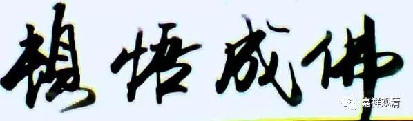

##  《善说精髓》006（中） 

在《阿含经》当中还 可以看出有 其他的 “ 次第 ” ，比如说我们最初的学修次第，可以分为四个基本次第 （ 我觉得道次第也完全可以按照这四个次第 ） ：第一是信，第二是戒，第三是定，第四是慧。由信然后有戒，再有定，最后有慧。 

那么 在 诸 道次第当中，最初的 “ 依止善知识 ” 不就是 “ 信 ” 吗？所有的 《 菩萨戒品 》 以前的内容全都属于与 “ 戒 ” 相关的，然后 “ 止观 ” 的部分就是 “ 定 ” 和 “ 慧 ”…… 所以也可以把道次第分为信、戒、定和慧 这样的次第 ， 可见 和《阿含经》 此处也 有 一致的。 由此可见，这个次第的密意被决择出来以后，我们可以发现佛经当中处处都是在讲修习次第的。 

而正如我们之前所说，汉传佛教非常有趣的一个事情就是，在觉得文字并不能够完美地表达意思以后，就突然想要抛弃文字了，想要通过一种突然之间的 “悟”的方法，来一下子获得佛法的真理，追求一种 “ 顿悟 ” 。实际上 这个时候的 “ 顿悟 ” 的意思和道生法师 那时 所说的 “大 顿悟 ” 的 “顿悟” 意思并不完全一样，虽然 禅宗的 “顿悟” 是延续道生法师 的 “大顿悟” 说下来的，但其实意思上是有转变的。道生法师的意思是和 般若、 中观相关的背景，只是他比较喜欢文字上的 “语不惊人死不休”，实际上他讲的这些内容在经典当中 （《般若》、《华严》） 基本上都是有的。 

##  竺道生像 

**“随学彼大阿阇梨”，**

就是去跟这些老师们学习。这些老师们具有戒、定、慧这样的功德，能够通达佛的密意，那么我跟这些老师们学习以后，自己也能够慢慢地增长教证的功德，能够通过理解佛的密意，再去好好地修行。 

这个 “ 密意 ” 呢，真的是有点难的。昨天晚上我们聊天的时候也讲到，有时候看起来好像真的有 “前辈子”这个东西。同样一句话，你能不能正确理解，完全不一样。我记得上次卓嘎也说过一个事情，就是上面老板在讲话，讲了两个小时，其实核心只有三个，聪明的人在听的时候是很随便的，但他能抓到这三个核心，这种人肯定能够提升，肯定能成为好员工。笨的人把讲话全部记录下来，但是也没啥用。 

我看到周围类似的情况真的太多了，有太多这样的情况。所以佛教里面讲 “生得慧”真的有点道理，有些 “ 智慧 ” 好像真的是娘胎里面带来的。我们大家可以检讨一下，看看自己娘胎里是否带来点东西，如果的确带来点东西的话，我们可以笑一笑，感觉自己还是不错的，希望下辈子再去娘胎的时候，也能带点东西过去。 

部派佛教里有一个 “说假部”，说假部有一个说法，叫“唯依福得解脱”，他也有这个意思，他们看见修行里面有些东西似乎单纯靠智慧（闻思修）还不够，还有背后的东西，于是说“解脱都是靠（上辈子带来的）福报”……说起来，真是越来越觉得他们的这个思路有道理啊！ 

