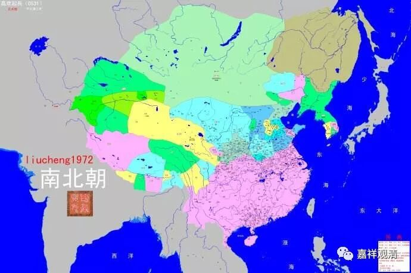
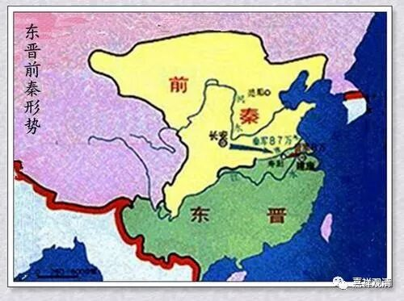

##  《善说精髓》008（下） 

上次我买了一整套书，大概有这么多，是某个系列海 师长 的传记。 我真的是蛮认真地想要看的，后来实在是看不下去了，这书有点像中国以前的皇帝起居录 ——今天干嘛，明天又干嘛，去哪里学法，又去哪里传法 …… 不用换名字，这个月和上个月没啥区别。 

那我们来讲讲阿底侠尊者吧。阿底侠尊者本身是王族，在今天的孟加拉国，当时是国王的儿子。传记当中把他捧得很高，这是因为印度比较喜欢铺张，说孟加拉国的一个小国王居然等同支那国， 哈哈哈哈，孟加拉某部落， 要跟中国一样，不可能啊！ 

今天就给大家多一个知识点，我也是前两天刚听到，觉得很有道理。以前印度人把中国叫 “震旦”，是吧？“震旦”的意思居然是支那斯坦，“震”就是支那，“旦”就是斯坦，“震旦”就是支那斯坦。“支那”就是 c ī na ，是伐？就是秦国的意思， cīna。 

“震旦”其实是一个译音，但是现在很多人 附会地 认为它是属于东方，是早上日出什么的，其实不是这个意思。 “斯坦”就是地方的意思，“支那斯坦”就是支那这个地方的意思。“震旦”，就是指秦国那个地方。有道理啊！又解决一个所知障 ，哦不，非染污无知 。 

前两天学习梵文的时候，那些同学讲的： “苦啊，这把年纪还要学梵文啊！”我现在要抄作业，得先把作业借到，甚至 还要故意写错两个 ，否则作业 都一样的话 ， 老师就 知道是抄作业了。 

阿底侠尊者 ，相当于 孟加拉的一个 …… 城主，对伐？或者说，就是镇长的儿子。那个时候，那个地方还是佛教传统国家 ——今天已经是伊斯兰教的地盘了。他很小的时候就出去学习过，中间回过国。 

以前看《阿底侠尊者传》的时候有点看不懂，说他 “回来装疯卖傻”，这是什么意思？现在知道了，“装疯卖傻”属于密宗里面的一种特殊的行为，家里人看不懂，不知道他的密意，就觉得：“完了！我们本来这么好的王子居然疯了，那他想干嘛就干嘛吧！”然后就允许他出家了。他如果是真疯的话，是不允许出家的，不允许的。我妈妈不同意我出家，我也曾经想过：“是不是装疯呢？”而 阿底侠尊者 已经实践了，我没按照这个实践，我是 “走失了”、“失踪了”。 

那么，首先他作为一名王族，会有很多资源在他周围，会有很多上层的老师在他周围教学，所以他前世的福报大也很有好处啊。我们有时候会觉得自己没有成为大师的唯一一个原因就是身边没有很多经师。可是再想一想，我们身边没有很多经师的原因，是我们上辈子没有好好修行。今天的情况好像又有点不同，即使身边有很多很好的经师，只要这些经师们一死，这些活佛们又都 可以放飞自己 了 —— 还是自律更重要啊 。 

然后，阿底侠尊者就跟从很多很多的师父去学习，包括显宗和密宗的内容。在传记当中还谈到一个非常有趣的情况，就是阿底侠尊者这个人 年轻时候 有点骄傲 ，认为自己啥都学遍了 。这类牛人好像都有这种情况，以前龙树菩萨也是这样，我们中观派好像都有点这个习惯。 

