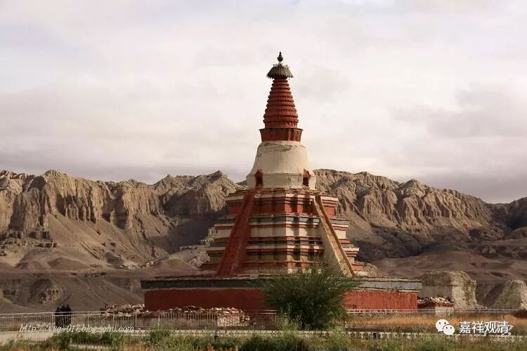
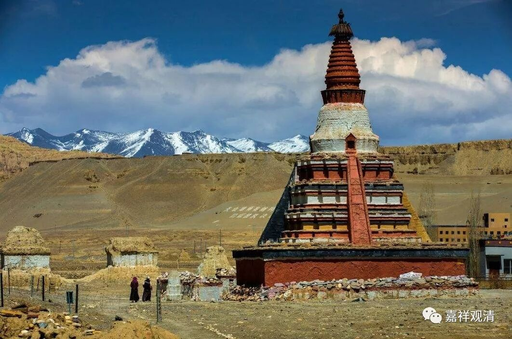

##  《善说精髓》讲记010（上） 

哎 ， 我们怎么讲到 玄奘法师 这里了 ？哦，今天要讲阿底侠尊者，结果一直讲到了玄奘法师。 

那么，阿底侠尊者出家以后，他能够被大家尊重的一个原因是他的背后有支撑，而我们的玄奘法师也是背后有支撑 ——有强大的祖国。今天，我们的祖国也是十分强大，前两天好像又撤侨了，是吧？中美洲的飓风不是刮得一塌糊涂吗？东航就派了两架飞机去撤侨。现在中国真是非常强大啊！这两天是我们的国庆节，全世界都在过中国的国庆节呢。 

阿底侠尊者在当时 的印度次大陆 是非常有名的，那个时期在今天的藏传佛教被称为 “ 后 弘 期 ” ，也就是佛教第二次大规模 地 从印度传入西藏的时期。 在此 （阿底侠入藏） 之前 ， 有大译师仁 钦 桑布稍微早一点 的时候 也去到过印度，现在的传记上还说去了 一百多个人 学习 ， 最后因为气候原因，藏人不耐热，最后 只有三个人活着，是吧？ 后期的故事就是这样丰富 …… 实际 却并 不是这样的 （大数据告诉我们，藏人离开高原明明活得更长嘛） 。 晚期的传记离真正的历史已经很远了 ……

我最近写过一篇文章 谈到 ， 今天 我们所看到的西藏早期的一些传记 （比如《仁钦桑布译师传》）就 不是 如晚近的故事 这样记载的 。 当时 （藏传佛教后弘期之初），阿里这边 最主要就是大译师 仁 钦 桑布 过去 印度学习 的，同行的 有 其他人 ，但其实是 服侍他的，不是 主要 去学习的 ，也没有百人之多 。从印度回来以后， 仁 钦 桑布又开展了很多的 教学 ，然后带出了一些弟子 ——早期的历史记载是这样的，并没有“上百人死剩三个”的悲壮故事，说起来，以前听到这么悲壮的故事还蛮感动的。 

##  托林寺，仁钦桑布后期主要驻锡的寺院 

仁钦桑布在印度待了很久，而 因为阿底侠尊者那个时候在印度的名气比较大，所以仁 钦 桑布就把这名气带回了中国，那么 阿里地区 也就知道了 “阿底侠” 这个名字 ，后来 阿里王 又派了 拿错 译师去迎请阿底侠尊者 。 仁钦桑布 的年龄要大于阿底侠尊者 ——这一点符合阿底侠很年轻就出名了的传说。 

