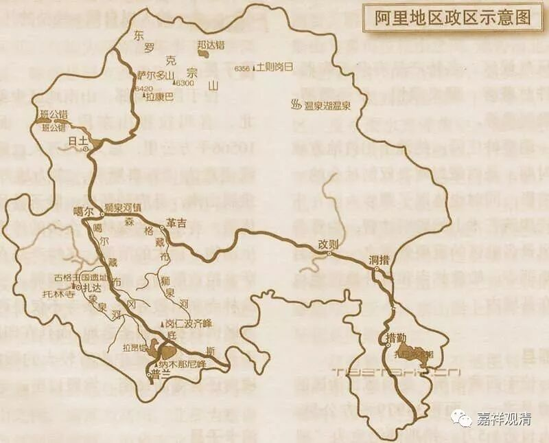
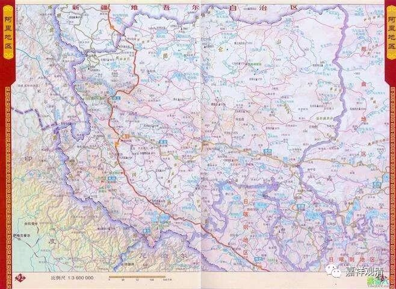
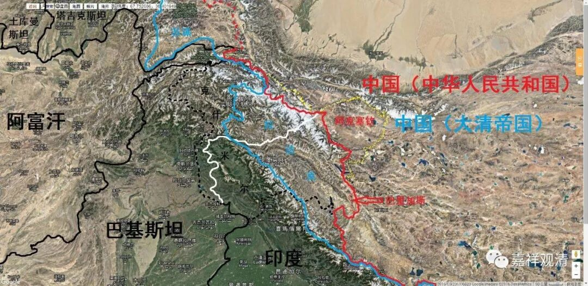
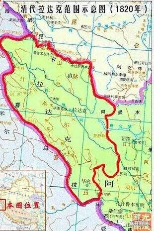

##  《善说精髓》010（中） 

这里面呢 ， 又有一个故事了。在传记当中说 绛 曲沃的爷爷 益 西沃 ，是 被 葛逻禄 人抓到 的， 是吧？ 其实 不是 。 最近我又看到 ， 葛逻禄人这个名字 ， 这个葛逻禄语好像是属于 “ 阿尔泰语系 ”—— 前 两 天我们在学习梵文，讲到有四大语系 。葛逻禄 人实际上 活动于今天中国新疆一带 ，新疆人去到西藏是比较晚的，他们 打仗的时候曾经 到过阿里，但那是比较晚期的事情了 ，就是说晚于阿底侠时期 。 所以是西藏人的记忆错乱了 ， 类似的事情是有的，但 实际上被抓的并不是 益 西沃， 而 是他的另外一个孙子 沃德 ， 这个人 后来死掉了。 益西沃是 死在托林寺的。也没去过克什米尔。 

据古格 ·阿旺札巴所著的《阿里王统记》（P58-59）记载： 

**“……（拉喇嘛·益西沃）他年事非常高的时候，带着拐杖对自己的修行场所转很多圈，发放布施取悦于众生。此是，有令在先，出了一名徒弟外不见任何人，整整三年闭门修行。修行完毕，以平民百姓的身份接见朝觐者，并为了最后传法，来到莽巨，后又回到托林寺，为佛法和众生奉献精力，直至寿终正寝……”**（转引自《传奇阿里》 P116） 

可见益西沃在托林寺寿终正寝，而非死于葛罗律 人的监狱。 

另 据《阿里王统记》（ P61-63）记载： 

**“……大哥维德（沃德）赞身强力壮，自小性情暴烈，凶猛无比。有一次征战到玛玉（拉达克），建立了拜土寺……后在竹夏（勃律）激战……在此受挫……两个弟弟试图赎回哥哥，敌人要与他身量相等的黄金，因黄金数量欠了一点，暂时留在那儿……他卸开脚镣逃跑，因无法逃脱因缘，铁锈中毒，就地去世……”**（转引自《传奇阿里》 P116） 

这是 “益西沃被俘死去”的故事原型——孙子的事情被按在了爷爷的头上……

 （地图上的拉达克地区，就是当年沃德征战失败被俘的地方，在今阿里西北，今在克什米尔印度实际控制区。） 

后来 绛 曲沃 （沃德的堂弟，益西沃 的另一个孙子 ） ， 也就是菩提光 ， 就迎请 到了 阿底侠尊者 。 阿底侠尊者其实是 在寺院（大菩提寺，就是今天印度菩提场哪个寺院） 请假去的藏 地 ，结果呢，藏 地 就 很幸运 。但是 对整个佛教来说 ， 不一定是很幸运的事情，至少对印度 佛教 来说就不是很幸运的事情。因为当时伊斯兰教开始通过印度的西北走廊向印度进攻 ， 阿底侠尊者在进入阿里地区以后，本来打算回印度的，但是这条走廊已经被伊斯兰 教 占领了，他就回不 去 了 。 所以他后来没有回印度， 这和 伊斯兰教跟佛教的战争有关，等于 一系列的穆斯林对印度的入侵行动 把阿底侠尊者留在了西藏 。 

对西藏来说这是一件好事，对印度呢 ， 就不是了 。 不过 ， 估计阿底侠尊者回去也是要被杀的 ， 嗯 ， 那还是 留在 西藏吧。如果你们看阿底侠尊者的传记 ， 可以看到他的兄弟， 还有 他的侄子 ， 后来 都 去了西藏 ， 是吧？当时真的是有一大批印度人都去了西藏，因为确实没有其他地方可逃了，往北逃还是比较容易 一点。而且呢，当时西藏又不太发达，不是伊斯兰教的目标。伊斯兰教侵略的主要目的是去掠夺的，对吧？ 

