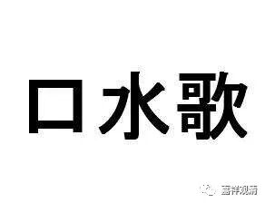

##  《善说精髓》010（下） 

后来阿底侠尊者就被迎请到了西藏，他在藏地的上首弟子 就是 仲敦巴尊者，是一位居士 。之后就 留下了噶当派的口传的传承 ， 格鲁派的核心背景就是由噶当派 传 下来的。但是 ， 相对于今天的格鲁派而言呢，噶当派对密法没有这么关注。早期的噶当派对密法学 得 并不是 很 多，主要学习的也是个别的 事部、行部的 法。 

当然 也有另外一个原因，很多的密传在今天都已经是很 “ 无密 ”地在传播 了 ， 以前都是一 两 个人之间进行传承教学的，现在呢 ， 动不动 就 有 成千 上万的人在教学。这个也是佛教一直以来存在的一个问题 ： 到底是走精英路线 呢， 还是走大众路线？ 

直到 今天 ， 我还觉得这是很矛盾的 。 到底应该走精英路线 呢， 还是应该走大众路线 呢 ？我个人还是有点 偏向 走 精英路线的 ， 是因为 这样 比较轻松一点 ， 自己也觉得自己比较牛叉一点 。 哎呀，有 点 自我陶醉啊 。 我觉得走精英路线的 人， 真的有点自我陶醉。我自己虽然水平不高，但是 也 有点自我陶醉 。 

如果明明是精英 ， 却走 了 大众路线，那是非常值得赞叹 的。 我觉得阿底侠尊者就是这样一个典范 。 他绝对是一 名 精英，可以说是佛教精英当中的精英，但是他是走大众路线的。大家 称他为 “业果喇嘛”、“皈 依 喇嘛 ” ，因为 他是讲业果、讲皈 依 的。 这太了不起了 ！ 精英走大众路线，就相当于顺子去唱口水歌。 

前两 天我在坐车的时候，听到司机在播放顺子的那首 《回家》 ，我当时就想到了这个事情。 顺子 的声音真的很好 ， 是吧 ？ 她的歌别人是没法唱的，因为太高 冷 了 。 所以大家崇拜完 了， 就结束了。但是像任贤齐这种 “心太软，心太软……”所有人都能唱的口水歌，马上就流行出来 了，是吧？ 阿底侠尊者就相当于 帕瓦罗蒂那种水平 ，然后去唱 “ 左三圈 ， 右三圈 ”的歌曲 ，这就需要放下身段 。也 说明他完全没有那种傲慢心，没有那种 “所恃” ，没有自己骄慢的地方。 

阿底侠尊者去到西藏以后，应菩提光的邀请回答了很多问题，包括佛经的前后问题、显宗和密宗有没有矛盾、清净的比丘能不能修这个那个等等，好像总共有十几个问题。阿底侠尊者听到这些问题之后是非常高兴的。话说回来，在这点上我们这些人真的是没法比啊，我们要是听到这些问题，马上就是： “烦死了，我已经讲过这么多遍了，你还不知道？！自己去听我的录音。” 这也是师徒的缘分好，徒弟正好问到关键点，师父正好憋了很久的心得正好倒出来 ……

