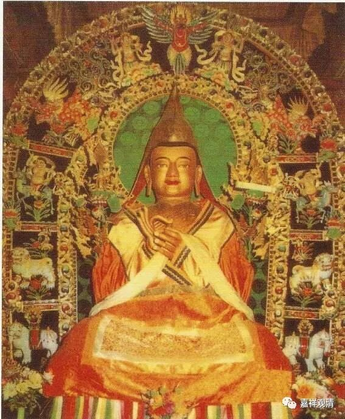
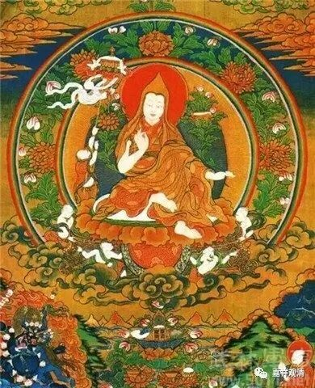

##  《善说精髓》011（下） 

离开青海到达拉萨附近的时候，年轻的洛桑扎巴（宗大师 法名 ） 主要学习的内容在我们今天就被称为五部大论 的内容（ 当然，五大部教学系统的定型在这时候还没有完成 ） ，差不多就是这五大部论典 ，包含但不仅限于这些， 应该范围非常宽泛了，包括噶当六轮等 。当时宗喀巴大师最主要的老师是仁达瓦大师，他是怎么找到仁达瓦大师的呢？因为宗喀巴大师 那一段时间 想要学习《集论》，但当时他身边没什么人在讲《集论》，而讲得最好的是仁达瓦大师，于是宗喀巴大师就专门去找到仁达瓦大师，跟随仁达瓦大师学习了《集论》方面的内容， 还不止一次的学习《集论》。 他们 师徒 互相之间长期地传法。 

##  唐卡·仁达瓦 

后来宗喀巴大师又到西藏南部跟随虚空幢大师学习了道次第的内容，就这样渐渐地把道次第的三大派系 ——教典派、教授派和教诫派的内容全部摄集在一起了。也就是说，既有书面上道次第的内容，又有直接教授的道次第的内容。 

最后，在一次法会的时候，宗喀巴大师就把全部的内容整理出来，写成了《菩提道次第广论》。这个在当时一出来就轰动了，因为写得非常好。在这部著作问世之前，佛教学修的内容都是 相对 零散的，而宗喀巴大师把它们整理出来，而且整理得非常清晰。如果我们去看《菩提道灯论》的话，就会发现它并不像《菩提道次第广论》这么清晰 、次第明白 。 

另外一方面，我们今天会说《菩提道次第广论》是 “把实修教授作为庄严”，什么意思呢？就是有一些在师徒密传当中教授的调心法等等，都形成了文字，放到菩提道次第的相应的教学当中去了，所以说它确实是一部集教典和教授为一体的 、指导 实修 的 作品。 

所以，《菩提道次第广论》一面世，就在当时获得了轰动了。引起轰动的另外一个原因是，宗喀巴大师把后面止观的内容整理得非常好，在此之前，能够把止观的内容整理好的就只有印度的《瑜伽师地论》，或者是印度的其他一些著作，在西藏还没有整理得这么好的作品，而宗喀巴大师就把这个内容整理得非常完整。 我经常说：汉传的唯识，就缺一个宗大师这样的人来做总结。（我们的情况是，能做总结的人没有，但想做祖师的人一大堆 ……） 

